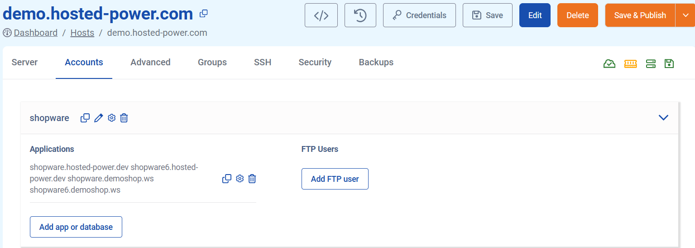
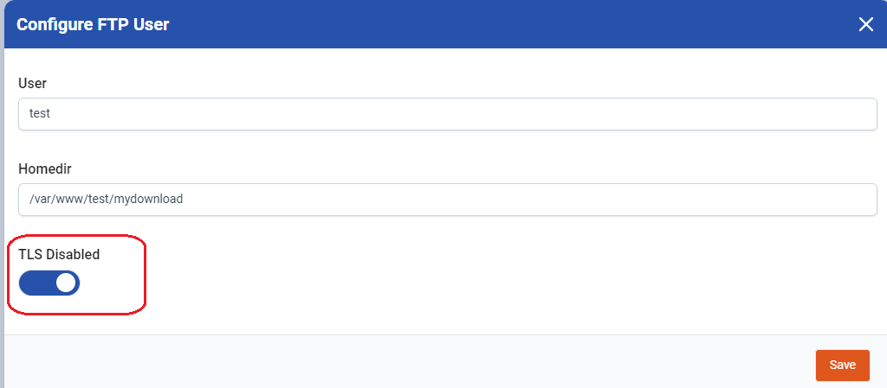

# (S)FTP Creation and troubleshooting
## Configuration
We provide the possibility to make a (S)FTP user and choose the *home directory* for that user. This is mostly used to connect an ERP system to a webshop.

(S)FTP users are created within the context of a normal system user.
## Creating the FTP user
### In the GUI
To create the user in the GUI, go to **Accounts**, click the *settings* **cogwheel** , then **Add FTP user**.



A new window will appear, where you can enter the name for the new FTP user and the *home directory*. If your application requires it, you can enable TLS in the same screen.

When done, click **Save** to exit the window, then **Save & Publish** to create the FTP user
### In the YAML
The following YAML will create a FTP user under the *stag* user.
Example:
```yaml
system_users:
- username: stag
  vhosts:
  - server_name: demo.hosted-power.com
    app_type: shopware
    php_version: "8.3"
    cert_type: letsencrypt
  ftp:
  - user: stagftp
    homedir: /var/www/stag/public_html/ftp
```
### Enabling SFTP
You must either choose FTP or SFTP for all users on your server. To enable SFTP for all of them, add the following line above **system users**:
```
ftp_sftp: true
```
### Choosing the SFTP port
By default, the SFTP port is **222**. Some ERP systems require a specific port. In that case, you can add the following line above **system users**:
```
ftp_sftp_port: 2222
```
Change port 2222 to the port your ERP system requires.

---
## What could cause a “Login failed” error ?

1. **Incorrect login details used**:
Login details used by users for FTP access include their username and password. If these credentials are given wrongly in the FTP client, it can result in a 530 login error in FTP.
   "530 Login authentication failed" errors also happen due to wrong password. Even a single additional space at the beginning or the back of a password can cause a login failure. 
2. **Path doesn't exist**:
When the FTP users is created, a path will be assigned on creation. If the path doesn't exist on the server, this will cause a login failure.
3. **No TLS used**:
TLS is required and enforced for security reasons. It's a very bad idea to disable it, since passwords would be sent in plaintext. Make sure to activate "Explicit SSL/TLS" in your FTP client. However, if you need to disable SSL anyway (For example incompatible ERP system that only supports plain text FTP), you can do so here: 
---