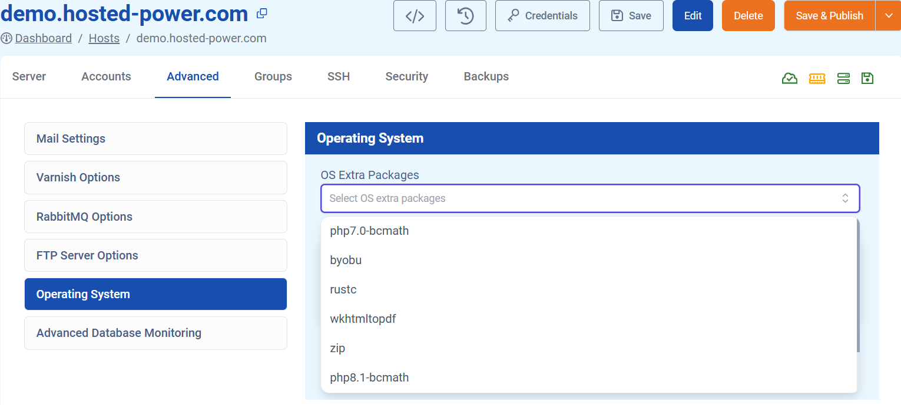

## How to find and install packages
We manage things for you, so you don't need root access on the server. However, this means you don't have the necessary permissions to install *apt* packages via the command line. This also has the benefit of easily setting up a server that requires a similar setup.

To solve this issue, we provide the possibility to install these packages via our TurboStack Interface.

You can find this feature under: **Advanced > Operating System > OS Extra Packages**. Here You can select some of the more common packages.



Should you need other packages than the common ones we provided, you can always add it directly in the YAML.

For example:
```yaml
os_extra_packages:
- acl
```

When you configured the packages you want to install, click "Save & Publish".

---
## Finding apt packages
Debian uses the apt package manager. Via the command line, you can find the specific packages you need. This will also show whether or not the package is already installed.

For this we use the following command:
```bash
apt search packagename
```
This will then return a list of packages for you to choose from. When you found the package, you'll need to copy the exact name in the TurboStack YAML of your Server, as described above.

### PHP example
PHP provides some of their packages via APT.

To search all available packages, for PHP version 8.2, use the following command:
```bash
apt search php8.2
```

After copy pasting the packages you want, **os_extra_packages** might look something like this:
```yaml
os_extra_packages:
- php8.2-amqp
- php8.2-ssh2
- php8.4-amqp
- php8.4-ssh2
- php8.4-dom
```
### Dynamic version installation
When you have a **php_main_version** parameter defined in the YAML, you can also include this in the install.

For example:
```yaml
php_main_version: "8.2"
os_extra_packages:
- php{{ php_main_version }}-amqp
- php{{ php_main_version }}-ssh2
```

