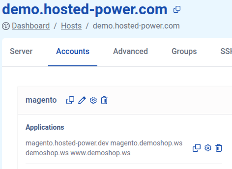
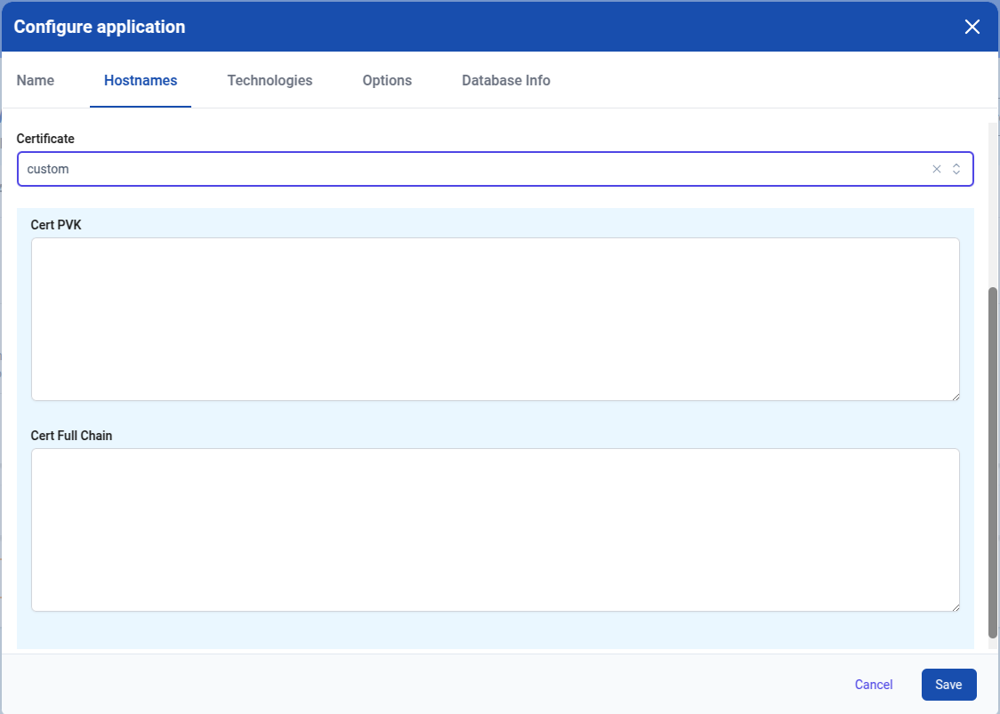
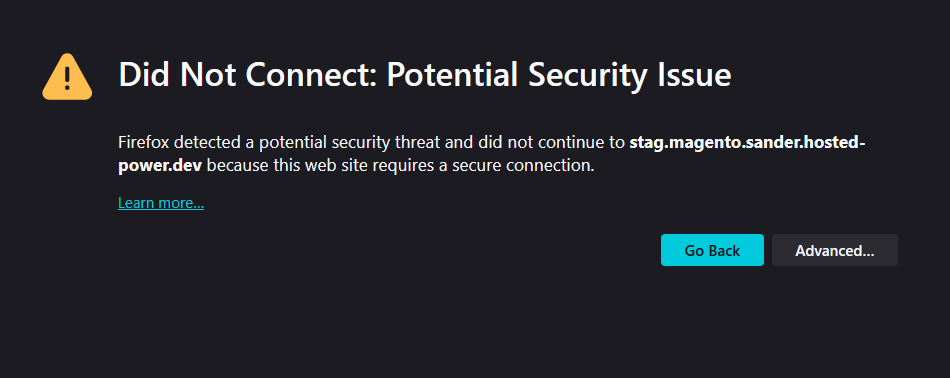
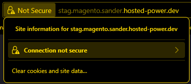
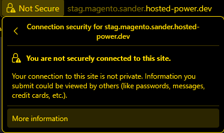
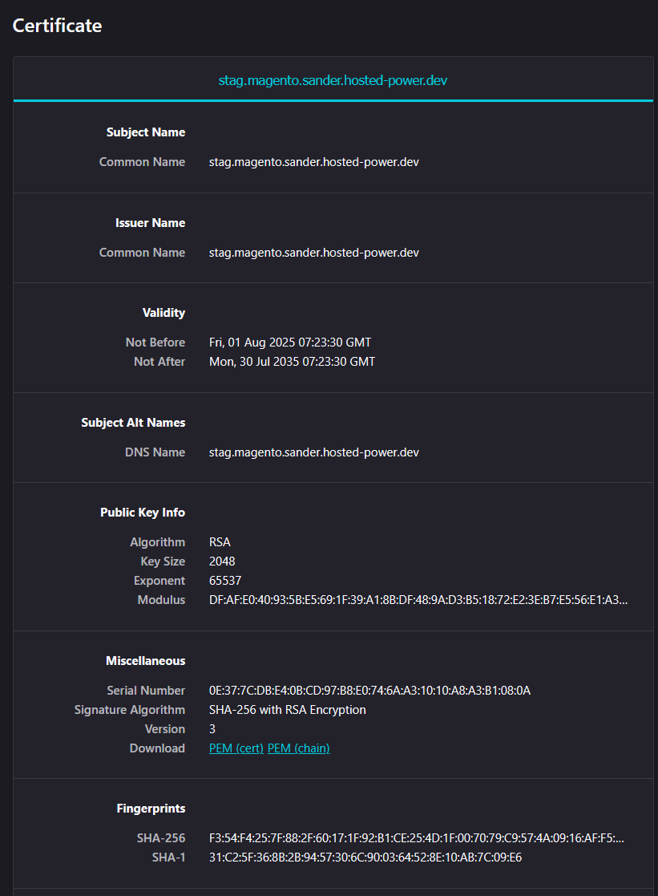
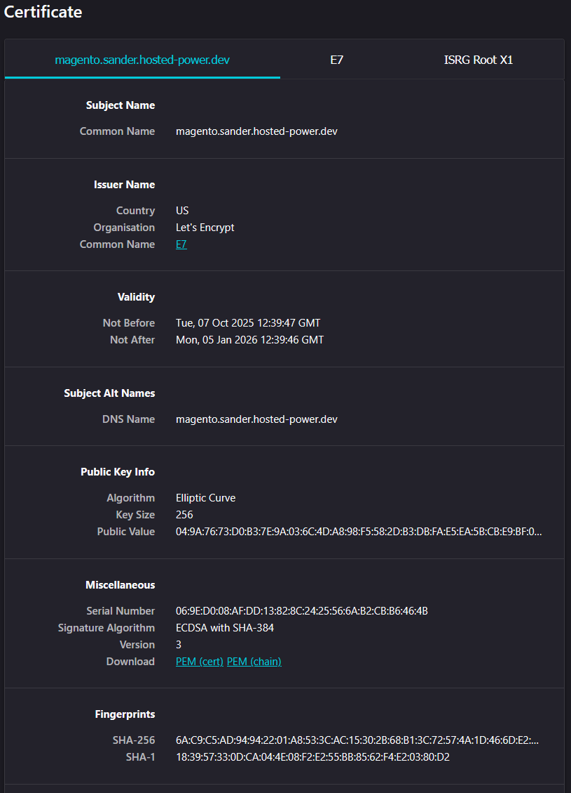
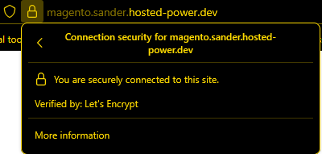

# SSL Certificates

An SSL certificate is a digital certificate that encrypts data between a website and its visitors, ensuring secure communication. It verifies a website’s identity and enables HTTPS, protecting sensitive information like passwords and credit card details from hackers. SSL is essential for the correct functioning of your website over HTTPS! 

## Certificate Authorities (CA)

A Certificate authority is a trusted entity responsible for issuing digital certificates used to authenticate the identities of entities such as websites, servers, users, and devices on the internet or within a private network.

### Let's Encrypt

LetsEncrypt is a certificate authority that provides X.509 certificates for Transport Layer Security (TLS) encryption at no charge. The certificate is valid for 90 days, during which renewal can take place at any time. The offer is accompanied by an automated process designed to overcome manual creation, validation, signing, installation, and renewal of certificates for secure websites.

Installing Let’s Encrypt on your TurboStack server is quick and simple. The only requirement is that your hostname(s) correctly point to the server in DNS. For detailed setup instructions, click [here](/TurboStack%20Platform/howto_newuser.md#creating-a-new-application-in-the-turbostack-platform).

The key principles behind Let's Encrypt, taken from their <a href="http://www.letsencrypt.org" target="_blank">website</a>
* Free - Anyone who owns a domain name can use Let’s Encrypt to obtain a trusted certificate at zero cost.
* Automatic - Software running on a web server can interact with Let’s Encrypt to painlessly obtain a certificate, securely configure it for use, and automatically take care of renewal.
* Secure - Let’s Encrypt will serve as a platform for advancing TLS security best practices, both on the CA side and by helping site operators properly secure their servers.
* Transparent - All certificates issued or revoked will be publicly recorded and available for anyone to inspect.
* Open: The automatic issuance and renewal protocol is published as an open standard that others can adopt.
* Cooperative: Much like the underlying Internet protocols themselves, Let’s Encrypt is a joint effort to benefit the community, beyond the control of any one organization.

### Third Party Certificates

Need an SSL certificate other than Let’s Encrypt? No problem! We offer Sectigo certificates—simply contact support for more details.

If you’ve purchased a certificate from another provider, you can still install it easily on your TurboStack server through the Account Management section of the [TurboStack Platform](https://my.turbostack.app "TurboStack Platform"). More info on how to do so can be found [here](/TurboStack%20Platform/howto_newuser.md#creating-a-new-application-in-the-turbostack-platform)

### Order a standalone SSL certificate

> **It is almost never required to purchase a standalone SSL certificate on TurboStack! Let's Encrypt will cover almost all cases. If you're unsure if this is correct for you, check with our support team first.**

Ordering a standalone certificate can be done easily through your [customer portal](https://portal.hosted-power.com/).

Unless you're looking for a specific kind of certificate, or were instructed to get a specific kind of certificate, you're looking for a 'Sectigo Positive SSL' certificate. When ordering, you'll be asked for a CSR (Certificate Signing Request). Either you know what this is already, you've been given one to use for this order, or you need to choose the option 'I don't have my CSR ready. I want to generate one now.'.

Once you do, you'll be asked to fill in the organization data of the organization requesting this certificate. Specifically for this type of certificate (Sectigo Positive), this data will NOT be verified against public records. When asked for the 'Certificate Common Name', you need to provide the domain you're looking to use this certificate for.

Lastly, you need to choose an email address for the email validation of your certificate to be sent to. This MUST be an email address on the root domain of the requested domain, and can only be one of 5 specific users:

> admin@domain.com
>
> administrator@domain.com
>
> hostmaster@domain.com
>
> webmaster@domain.com
>
> postmaster@domain.com

Once you've completed your order, you'll be sent an email to that chosen address, with instructions to validate your request. Once validated, within 10 minutes your certificate should be issued, and available in your customer portal!

### Optional: Create a CSR
Instead of using Let's Encrypt to generate an SSL certificate, you can obtain one from another certificate authority. To do this, you will need to create a Certificate Signing Request (CSR). For security reasons, we recommend generating the CSR on the server itself, so the private key does not need to be transferred from another computer.

#### Certificate with Multiple Subject Alternative Names (SAN)

To generate the private key and a CSR containing multiple subject alternative names, follow these steps:

###### 1. Create the .san File

Example configuration file (`server.san`):

```ini
[ req ]
default_bits = 4096
distinguished_name = req_distinguished_name
req_extensions = req_ext
prompt = no

[ req_distinguished_name ]
countryName = BE
stateOrProvinceName = OVL
localityName = Gent
organizationName = Hosted Power
commonName = www.hosted-power.com

[ req_ext ]
subjectAltName = @alt_names

[alt_names]
DNS.1 = www.hosted-power.com
DNS.2 = hosted-power.com
DNS.3 = hosted-power.be
DNS.4 = www.hosted-power.nl
DNS.5 = mail.hosted-power.com
```

**Hint:** The common name (`commonName`) must match your domain, e.g., *www.example.com*. For wildcard certificates, use `*.example.com` as the common name.

#### 2. Generate the CSR

Use the following command to generate both the CSR and the private key:

```bash
openssl req -sha256 -new -newkey rsa:4096 -nodes -keyout server.key -out server.csr -config server.san
```

In this case, **server.csr** is our signing request. Provide this to your preferred CA to generate the required files (public key, CA certificate, ...etc)

---
### Turbostack

_We recommend adding the private key and the certificates via the GUI, because of the formatting._

When opening your server in the TurboStack GUI:

- Click **Accounts**
- Click the **cog** of the account
- Click the **cog** of the applications



You can now configure your application:

- Click **Hostnames** and scroll down a bit
- Select the **custom** certificate type
- Enter the **private key**
- Enter the **fullchain certificate** in the right order:
  - Public Key  
  - CAA Certificate  
  - Intermediary certificates (usually 1 or 2)
- Click **Save**
- Click **Save & Publish**

**Hint:** If the publish fails, the intermediary certificates could be in the wrong order.




## Troubleshoot SSL problems


The screenshot above, and others like it depending on your browser, indicates an issue with the SSL certificate on the website your trying to visit. In the steps below, I'll explain how you can get the necessary information out of your browser to pinpoint the problem and to figure out how to fix it.

### Gather intel
First, you should check the URL in your address bar and make sure the website you're trying to reach is supposed to have an SSL certificate. When connecting to staging environments, or the server's hostname for example, there may not be a valid certificate configured. You can check which URLs are covered by a valid SSL certificate in the 'Users' tab of your server in Turbostack App, all domains connected to an application configured with 'letsencrypt' or a 'custom' certificate should have a valid certificate installed. Once we're sure there is a problem, we can check the actual certificate being presented to our browser:

![Screenshot of Firefox advanced error information, showing the 'View Certificate' button]image/ssl/ssl_advanced_error.png) 

You may need to click 'Advanced' or a similar button to show the option to 'View certificate'. If this button is not available, you can check the certificate in your address bar as well, by clicking the lock icon before the URL:





At this point, you'll get to see the certificate details. Since this is not a valid certificate, there will be less information, like this:



If we compare that to the certificate detail page of a valid certificate like below, we can see that the 'Issuer' of this certificate, is simple the server hostname. This indicates it is a certificate that is only installed for technical reasons and doesn't provide any actual certification, leading to your browser rejecting it.



Here we see the 'Issuer' of the certificate is Let's Encrypt, a valid certificate authority and also what is configured in Turbostack App for this application (cert_type: letsencrypt). You can also usually verify this directly in the security fold-out, depending on browser:



### Header 2
Now that we know where to find the certificate details, we'll go over all the likely causes of a safe connection not being able to be made.

#### Expired certificate
In the certificate detail view in your browser, you should be able to check when the certificate is valid. If this period has expired, or rarely, not started yet, your certificate is no longer (or not yet) valid and needs to be replaced with a valid one. If this website uses 'custom' type certificate, this means renewal is not automated and must be done manually. In this case, you'll need to go to [TurboStack App](https://my.turbostack.app "TurboStack App") and replace the certificate part of the configured certificate. Assuming it's just a renewal, the CA bundle and private key can stay the same. If your website uses the 'letsencrypt' certificate type though, that all gets taken care of automatically. So in this scenario, there's a couple of steps to take to eliminate potential issues:

- Check whether the URL is correctly pointing to our server. If the A/AAAA records point elsewhere, any issues are happening on the other server. You can use the following commands:
Linux: `dig domain.com`
Windows: `nslookup domain.com`

- Assuming your domain points to your Turbostack server, check your application in [TurboStack App](https://my.turbostack.app "TurboStack App") to make sure it's correctly configured as `letsencrypt`

- Once you've checked that, verify that all domains linked as `server_name` to your application have at least one A/AAAA record pointing to this server, and none pointing elsewhere. Let's Encrypt verifies domain ownership by verifying your server to the DNS records of the domain.

- If all of these are fine, you can publish your server configuration using the `Save & publish` button. If anything goes wrong with the publish, the error should describe the problem. If this doesn't clear it up, please open a support ticket so we can provide you further assistance. If the configuration is succesfully published, but you still have issues with your SSL certificate, please contact support so we can help you troubleshoot further

#### Unknown authority
If the certificate issuer isn't one of the recognized root CAs, your browser is likely to not recognize the certificate itself. On our servers, this should only happen if your app's SSL is set to `selfsigned`. In this case, the issuer in the SSL detail view will be the hostname of the server itself, e.g. `web1.hosted-power.com`. You can verify this by checking your app's SSL setting in [TurboStack App](https://my.turbostack.app "TurboStack App") and enable it as described [here](/TurboStack%20Platform/howto_newuser.md#creating-a-new-application-in-the-turbostack-platform)

#### Certificate hostname not known
This error indicates the URL you're connecting to is not part of the, otherwise valid, SSL certificate that is configured on the website. This usually only happens with custom SSL certificates, where not all hostnames linked to the app in [TurboStack App](https://my.turbostack.app "TurboStack App") are covered by the installed certificate. In this case, you need to either remove these hostnames from your application's configuration, or have your certificate provider reissue the certificate with the added hostname(s)