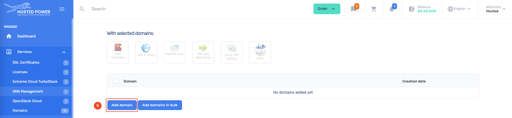

# DNS

The Hosted Power [customer center](https://portal.hosted-power.com/) has an application to manage DNS domains.
It can be used to manage existing domains or new after registering a new [domain](./Domains.md)

!!!danger Control panels
if you already use a control panel like `DirectAdmin` or `Cpanel`,
we recommend using those internal DNS management tools
!!!

## Nameservers

The Hosted Power nameservers

```yaml
ns1.hosted-power.com
ns2.hosted-power.com
ns3.hosted-power.com
```

## DNS Management





1. Open the order menu
2. Select `DNS Management` from the menu
3. checkout the [!badge variant="success" text="FREE"] service
4. The `DNS Management` service is now available
5. Open the management tool
6. Add 1 domain or multiple in bulk
7. Add the domain you already registered
8. Accept the domain
9. New records can be added like: `A`, `AAAA`, `CNAME`, `TXT`, ...
