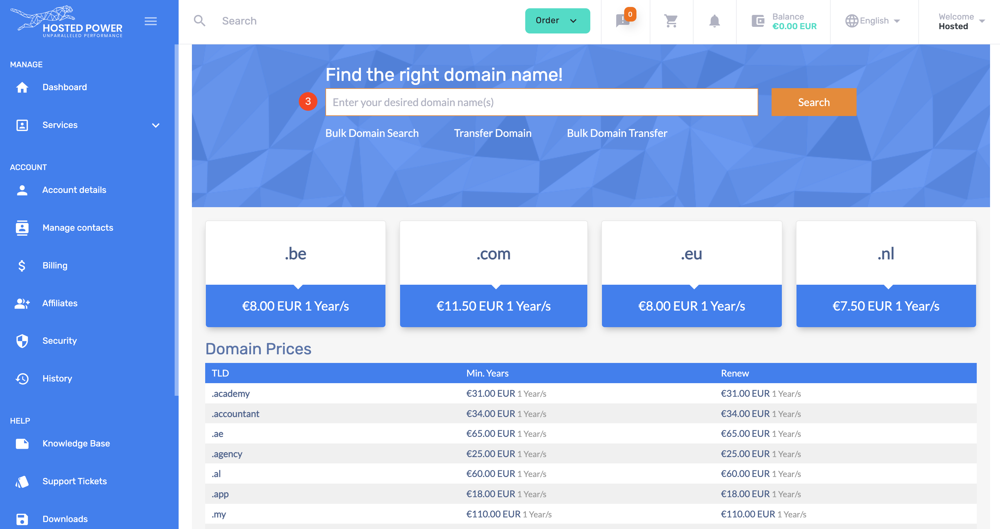
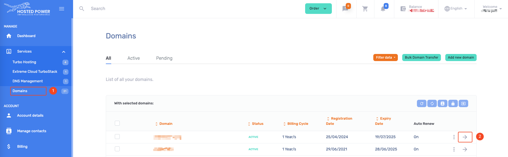

# Domains

Hosted Power is a domain registrar. Meaning domains can be bought, registered and managed 
within our [customer center](https://portal.hosted-power.com/checkdomain/domain-registration/)

There you can see the pricing for all TLDs and lookup if your preferred domain is still available.

## How to order a domain

1. Open the order menu
2. Select `Domain Names` from the menu
3. search the domain name you want to register/purchase
4. now you can register a new domain of start the transfer from a domain hosted at another registrar

## How to remove a domain

1. on the left hand menu open `services` and select `Domains`
2. Choose the domain you no longer need and click the arrow.
3. select the `Auto Renew` option
4. Change the auto renew to `Off`
5. save the changes

!!!info Info
All domains are registered and paid for 1 year at the time.
disabling the auto renew will make sure the domain is not charged anymore to your account
after the expiration date.
!!!

## (Bulk) transfer domains

## Change owner

...
