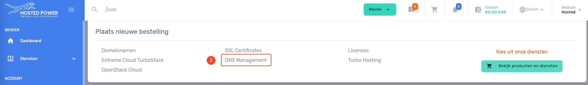
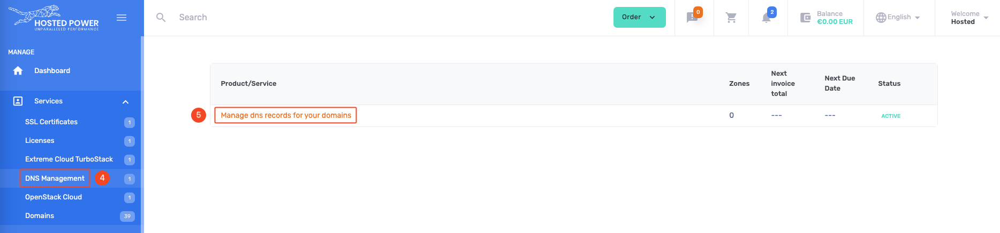
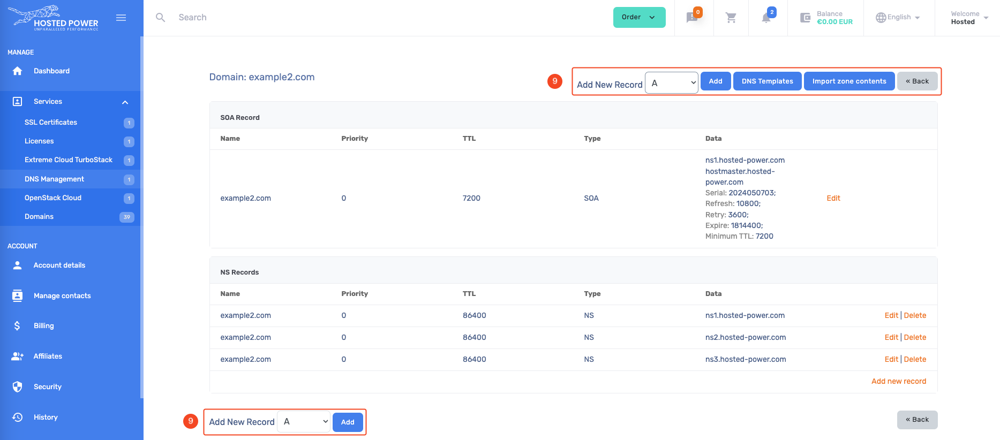

# DNS

The Hosted Power [customer center](https://portal.hosted-power.com/) has an application to manage DNS domains.
It can be used to manage existing domains, or new ones after registering a new [domain](./domains)

!!!danger Control panels
if you already use a control panel like `DirectAdmin` or `cPanel`, we recommend using those internal DNS management tools. More information on DNS management in those control panels can be found in their own respective knowledge bases.
!!!

## Nameservers

The Hosted Power name servers:

```yaml
ns1.hosted-power.com
ns2.hosted-power.com
ns3.hosted-power.com
```
When transferring a domain, the current name servers will remain active until you manually switch to our name servers. Make sure all necessary DNS records are present before updating the name servers!

## DNS Management

1. Open the order menu

2. Select `DNS Management` from the menu

3. checkout the [!badge variant="success" text="FREE"] service

4. The `DNS Management` service is now available
5. Open the management tool

6. Add 1 domain or multiple in bulk

7. Add the domain you already registered
8. Accept the domain

9. New records can be added like: `A`, `AAAA`, `CNAME`, `TXT`, ...


## DNSSEC

DNSSEC is an optional setting that can be enabled for certain domain/DNS setups where a keypair is generated to provide extra security and validation to a DNS zone.

**How does it work?**

For DNSSEC to work, a public/private keypair must be generated. The public key is then stored on the side of the registry, while the private key is stored on the server managing your DNS zone. With this, anytime a client makes a request for a DNS record, they'll know to check the zone for the DNSKEY record to validate the response, or consider it bogus. This makes it a great defense against man-in-the-middle attacks trying to hijack your DNS traffic and redirect your visitors.

**Potential issues**

It's important to understand how to verify your DNS setup when enabling this, since a misconfiguration can cause your entire DNS zone, and thus all related services, to become unavailable. A vital tool in checking your DNSSEC setup is https://dnsviz.net/ an online application where you can get a visualization of the delegation of your DNS zone. Below is a sample setup of a domain without DNSSEC enabled. 


Here you can see the delegation for the hosted-power.com domain, going from the root zone of the internet, to the .com zone, to the actual DNS zone we host for our hosted-power.com domain. If your DNSSEC is misconfigured, you'll see the records in the zone for your domain, so the lowest section of the graph, turn red and indicate the issue with an alert. This means there's an issue in validating your DNSSEC setup

**Enabling DNSSEC**

If this sounds like something useful for one or more of the DNS zones you manage through us, you can follow the steps below to set this up, depending on your setup.

### External DNS

In case your domain uses an external DNS zone, you'll need to enable DNSSEC on that external platform. Then, once you have the public key information from there, you need to pass those on to your domain registrar. If that's us, great, you can just create a ticket and we'll enable DNSSEC on the domain level. Otherwise, contact your 3rd party registrar.

### cPanel DNS Zone

In case your domain uses a DNS zone managed through one of your cPanel servers, you'll need to enable DNSSEC inside cPanel. To do this, you can follow this guide https://support.cpanel.net/hc/en-us/articles/1500011590261-How-To-Enable-DNSSEC-on-a-Domain. If you find the DNSSEC option is not available, you may need to enable it in WHM for which you can follow this guide https://docs.cpanel.net/knowledge-base/dns/dnssec/. Then, once DNSSEC is enabled for the DNS zone you'll be able to retrieve the key information and pass this along to your domain registrar. If that's us, great, you can just create a ticket and we'll enable DNSSEC on the domain level. Otherwise, contact your 3rd party registrar.


### DirectAdmin DNS Zone

In case your domain uses a DNS zone managed through one of your DirectAdmin servers, you'll need to enable DNSSEC inside DirectAdmin. To do this, you can follow the guide https://docs.directadmin.com/other-hosting-services/dns/maintaining-records.html#how-to-enable-dnssec-on-a-directadmin-server to enable this. Once done, you'll be able to retrieve the key information and pass this along to your domain registrar. If that's us, great, you can just create a ticket and we'll enable DNSSEC on the domain level. Otherwise, contact your 3rd party registrar.

### Customer panel DNS zone
In case your domain uses a DNS zone managed directly through your Hosted Power customer account panel, we'll have to manually get this set up for you. In this case, please make a ticket informing us which domain you'd like to enable DNSSEC for, and we'll get that done for you.

