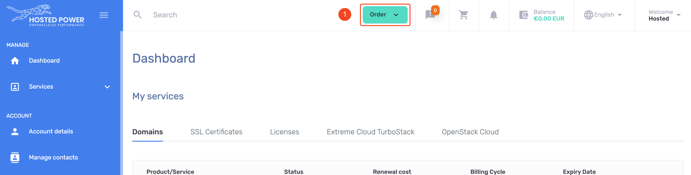
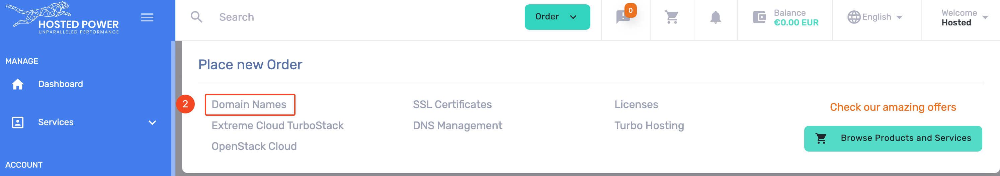
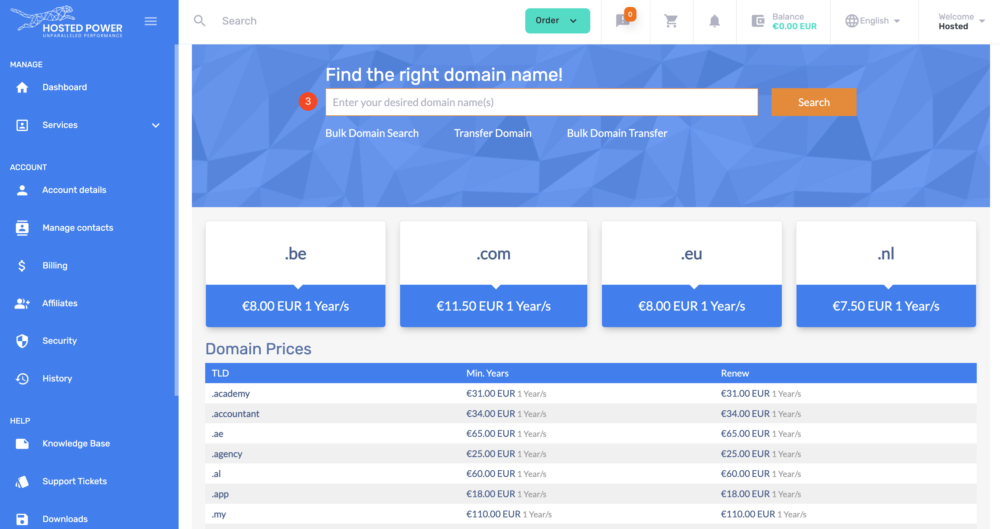
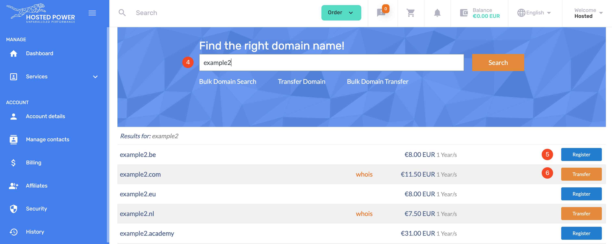
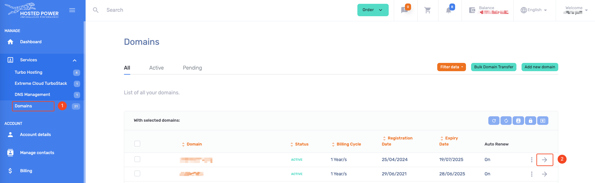
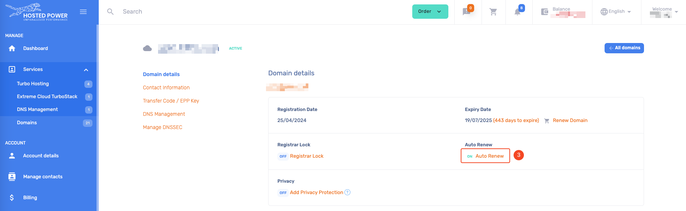
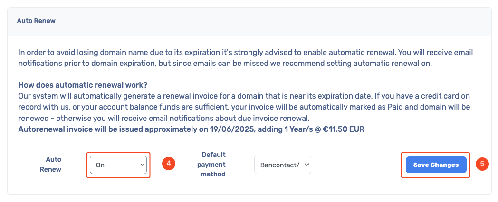

# Domain names

Hosted Power is a domain name registrar, meaning domains can be bought, registered and managed
within our [customer center](https://portal.hosted-power.com/checkdomain/domain-registration/)

Here, you can see the pricing for all (g)TLDs and look up if your preferred domain is still available.

## Ordering a domain name

1. Open the order menu

2. Select `Domain Names` from the menu

3. Search bar for domain names

4. Search the domain name you want to register/purchase
5. Now you can register a new domain...
6. ... or start the transfer from a domain hosted at another registrar


## How to cancel a domain name

1. On the left hand menu, open `services` and select `Domains`
2. Choose the domain you no longer need and click the arrow.

3. Select the `Auto-renew` option

4. Set the auto-renewal to `Off`
5. Save the changes


!!!Info
All domains are registered and paid for 1 year at the time.
Disabling the auto-renewal will make sure the domain is not charged anymore to your account after the expiration date.
!!!
## Name Servers
Setting your domain's name servers is how you make sure the correct DNS records are used. These look like the following, which are our name servers and the default setting when registering a new domain:
```
ns1.hosted-power.com
ns2.hosted-power.com
ns3.hosted-power.com
```
To change the nameservers of a domain registered with us, go to your [Customer Center](https://portal.hosted-power.com 'Customer Center'), find your domain under Services > Domains where you can see the currently configured nameservers. Click the button labelled 'Nameservers' under these to open the widget and change to your desired nameservers. If you want your DNS records to be managed through our platform, you can simply choose the 'Our nameservers' option.
## Domain name transfers
If you already own your desired domain with a different provider, and would like to transfer it to us, the process will be different depending on which (g)TLD the domain uses, like .be, .com or .dev. As such, we can't make a step by step guide but below we've listed the most commonly required actions and explanations to make it clear for you.
### Authorization code (EPP)
Most domain transfers will require you to request a code from either your current provider or directly from the (g)TLD registry. If you're unsure where to retrieve this info, contact your current domain provider and ask them how to acquire the EPP code, or authorization code, to initiate a domain transfer.
### Requesting the transfer
The only step you'll need to to for any domain, order it as a transfer through your customer center. For specific instructions, please refer to the section '[Ordering a domain name](#ordering-a-domain-name)' above. You'll be prompted to enter your transfer code, this is where you enter the EPP code you got from your current provider.
### New Nameservers
Depending on your setup, doing a transfer might mean you need to change nameservers. If you were currently using your domain providers nameservers for your domain's DNS zone, you'll need to switch that over to ours. When starting a transfer, you'll have the choice to keep existing nameserver, set new ones or specifically change to ours. If you intend to use our nameservers, be sure to refer to the [DNS section](./dns.md "DNS") of our docs to make sure you have the DNS zone ready before switching to ensure no downtime related to that change. We recommend you do this before starting the transfer, as some (g)TLDs require a working DNS zone before being able to process the transfer.
### Mail validation
Many (g)TLDs will send a validation email to the domains registrant, so the domain owner. Confirming the transfer through said email is always recommended, since it is either required to properly transfer the domain, or will speed up the process for others.
### Explicit confirmation
For certain (g)TLDs, most notably .com, your current provider can confirm a transfer to have it process instantly, rather than over a period of 5 working days. As such it can be worthwile informing your current provider you've started this transfer and asking them if it is possible to confirm the transfer
### IPS TAG
A few (g)TLDs don't use the aforementioned EPP code for authorization, most notably .co.uk. To do these transfers, you'll need to inform your current provider of your intention to transfer and provide them our IPS tag, since they will need to send the domain to us. Do note you should first order the transfer in your customer center for this to work smoothly.

IPS: `KEY-SYSTEMS-DE`