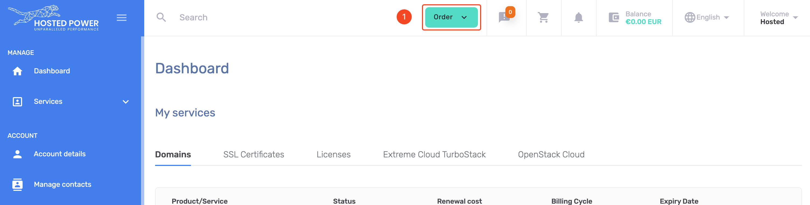

# Domain names

Hosted Power is a domain name registrar, meaning domains can be bought, registered and managed
within our [customer center](https://portal.hosted-power.com/checkdomain/domain-registration/)

Here, you can see the pricing for all TLDs and look up if your preferred domain is still available.

## Ordering a domain name

1. Open the order menu

2. Select `Domain Names` from the menu

3. Search bar for domain names

4. Search the domain name you want to register/purchase
5. Now you can register a new domain...
6. ... or start the transfer from a domain hosted at another registrar

## How to cancel a domain name

1. On the left hand menu, open `services` and select `Domains`
2. Choose the domain you no longer need and click the arrow.

3. Select the `Auto-renew` option

4. Set the auto-renewal to `Off`
5. Save the changes

!!!Info
All domains are registered and paid for 1 year at the time.
disabling the auto-renewal will make sure the domain is not charged anymore to your account
after the expiration date.
!!!
