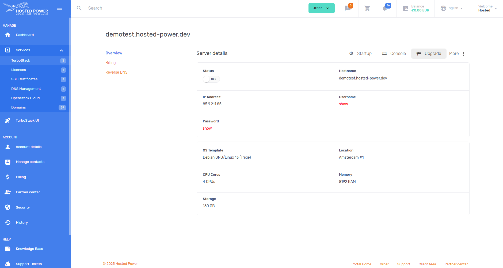
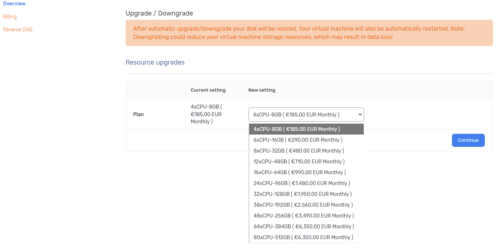

# Server upgrade
You can easily upgrade your server via our [customer center](https://portal.hosted-power.com).

To do this, go to our customer center and select your server that needs to be upgraded via **Services > TurboStack > _Your Server_**.

In this server overview, on the right side of the _Server Details_ click the _Upgrade_ button.

This will bring you to the overview of your server plan. Here you can select the new size for your environment.

Platinum servers don't require a reboot for an upgrade. Other servers will be rebooted.  This is an automated process.

After you chose the new plan, click _Continue_ to go to the billing overview. To start the automated upgrade process, click _Submit_.