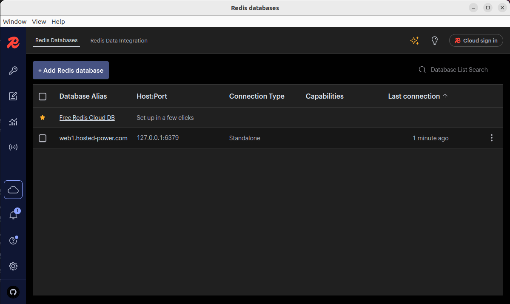
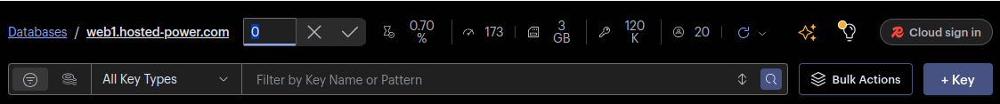
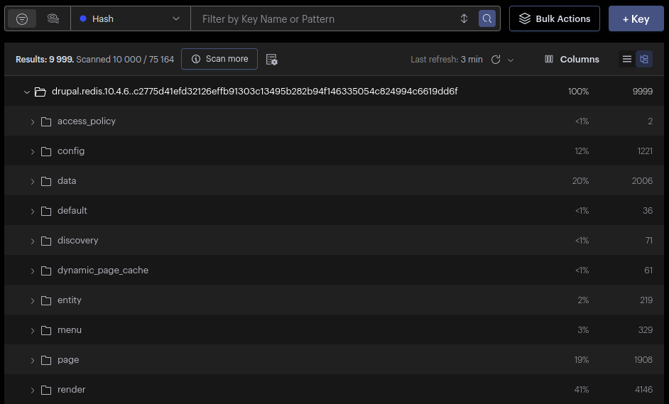
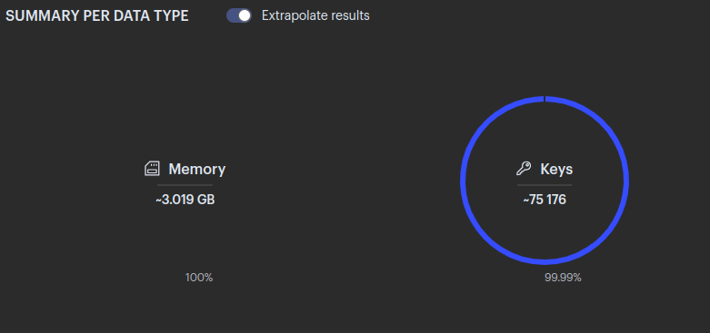
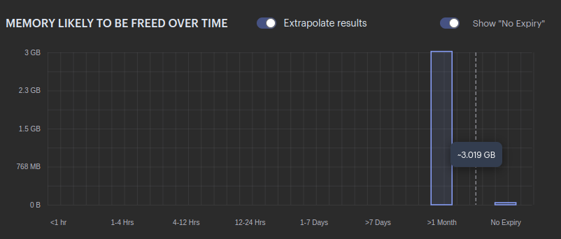

# Redis Insight Guide

**Redis Insight** is the GUI that makes analyzing data in Redis much easier. This is especially useful when customers store large volumes of data.



---

## How to Use Redis Insight

1. **Click "Add Redis Database"**

2. **Enter the following information:**
    - **Database Alias:** Hostname of the server  
    - **Port:** 6379 (caching) or 6378 (persistent)  

    **Under Security:**
    - **USE SSH TUNNEL**  
        - **Host:** IP  
        - **Port:** 22  
        - **Username:** TS username (from credentials)  
        - **Password:** Password for TS user  

3. **Click the DB alias** to connect to the server.
> **Note:** For this to work, authentication with a password must be enabled.

4. **Select the database you want to analyze.**  
   These can be identified through:
    - Our monitoring (look under 'Redis-default-memory' check)
    - Or with the command:  
      ```bash
      redis-cli info keyspace
      ```

   By default, the database is set to `0`. You can change this at the top of the program.

   

5. **Manually browse the keys**  
   See which key types expire and when.

   

6. **Use the analysis tool from the left-hand menu**  
   This is the most useful feature. After generating a report, you'll be able to see:
    - Total memory used
    - Total number of keys
    - Top 15 keys (sortable by TTL)
    - Most used key types and their memory usage
    - Size of expiring and non-expiring keys

   

   