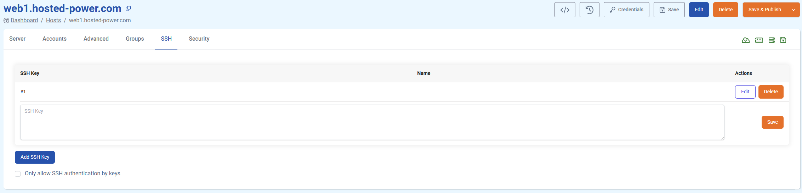

# Add an SSH key to an existing server

Depending on your type of server, your method of adding SSH keys may change. In this article, we'll go over the different ways to add your SSH key to your TurboStack server (and how to create a keypair if you haven't already). Please note we recommend using **ed25519** as scheme, however all our different platforms support any OpenSSH-compatible scheme.

## Step 1: Generating a new SSH keypair

If you already have your SSH key you'd like to add, feel free to **skip to step 1.**

You only need to **choose one** of the methods below to generate your SSH key:

* **Method 1: Using WSL, Linux, or Mac Terminal** (Recommended for most users)
* **Method 2: Using PuTTY Key Generator** (For Windows users who prefer PuTTY)

### Method 1: WSL, Linux, Mac terminal

```bash
ssh-keygen -t ed25519 -C "your-email@example.com"
```

* The `-t ed25519` flag specifies the **ed25519** algorithm, which is more secure and faster than older schemes like RSA.
* The `-C "your-email@example.com"` flag adds a comment to help identify your key.

After running the command, you'll be prompted to:

* Choose a file location to save the key (press **Enter** to accept the default `~/.ssh/id_ed25519`).
* Set a passphrase for added security (optional but recommended).

Once generated, you should have two files:

* **`id_ed25519`** – This is your private key (never share it!).
* **`id_ed25519.pub`** – This is your public key (this is the key you will add to your server).

To display the contents of your public key, use the following command:

```bash
cat ~/.ssh/id_ed25519.pub
```

### Method 2: Putty Key Generator

#### 1. Open PuTTYgen

* Download PuTTY from [the official source](https://www.chiark.greenend.org.uk/~sgtatham/putty/latest.html) if you don’t already have it installed.
* Open **PuTTYgen** (`puttygen.exe`).

#### 2. Generate an Ed25519 Key

* In the **PuTTY Key Generator** window, locate the **Parameters** section.
* Select **EdDSA** (Ed25519 should be the default curve).
* Click **Generate** and move your mouse randomly over the blank area to generate randomness.
* Once completed, PuTTYgen will display the **public key** at the top.


#### 3. Save Your SSH Key Files

* Click **Save private key** and save it as `id_ed25519.ppk`.
  * (Optional) Enter a **passphrase** for additional security.
* Click **Save public key** and save it as `id_ed25519.pub`.
* (Optional) If your server requires an **OpenSSH format key**, go to **Conversions > Export OpenSSH Key**, then save it as `id_ed25519`.

## Step 2: Adding your SSH key to your server

###  Turbostack server

1. Go to your **Turbostack** server in the GUI.
2. In the ribbon menu, click '**SSH**'.
3. Paste your **public key** into the textbox.
4. Click '**Save & Publish**'



If you need to add keys to multiple servers, you can use the [groups](https://docs.turbostack.app/turbostack-app/groups/#groups) functionality to streamline this process.

### cPanel

#### Normal User

1. **Log into cPanel**

   * Navigate to your cPanel account (usually at `https://your-domain.com:2083` or `https://your-server-ip:2083`).
   * Enter your **username** and **password** to log in.
2. **Go to the SSH Access Section**

   * In the cPanel **Dashboard**, locate the **Security** section.
   * Click on **SSH Access**.
3. **Import Your SSH Key**

   * Click **Manage SSH Keys** → **Import Key**.
   * Under **Public Key**, paste the contents of your **id\_ed25519.pub** file.
   * (Optional) You can also upload a private key here if needed for authentication.
   * (Optional) You can provide a passphrase for extra security.
   * Click **Import** to save the key.
4. **Authorize the SSH Key**

   * After importing, return to **Manage SSH Keys**.
   * Find your newly added key under the **Public Keys** section.
   * Click **Manage** → **Authorize** to enable the key for SSH access.

#### Root user

1. **Log in to WHM**

   * Access WHM via `https://your-server-ip:2087` or `https://your-hostname.com:2087`.
   * Enter your **root credentials** to log in.
2. **Go to the SSH Key Management Section**

   * In the WHM **Dashboard**, locate **Security Center**.
   * Click on **Manage root’s SSH Keys**.
3. **Import the SSH Key**

   * Click **Import Key**.
   * In the **Public Key** field, paste the contents of your `id_ed25519.pub` file.
   * (Optional) You can also import a private key if needed.
   * (Optional) You can provide a passphrase for extra security.
   * Click **Import** to save the key.
4. **Authorize the SSH Key**

   * Go back to **Manage root’s SSH Keys**.
   * Locate your newly added key under **Public Keys**.
   * Click **Manage** → **Authorize** to enable the key.

### DirectAdmin

1. **Log in to DirectAdmin**

   * Open DirectAdmin at `https://your-server-ip:2222` or `https://your-domain.com:2222`.
   * Enter your **admin** or **user** credentials.
2. **Navigate to the SSH Key Manager**

   *  Go to: **User Level > SSH Keys**
3. **Add a New SSH Key**

   * Click **Add SSH Key**.
   * In the **Public Key** field, paste your SSH key (from `id_ed25519.pub`).
   * Click **Save**.
4. **Authorize the SSH Key**

   * After adding, ensure the key is **enabled** in the SSH Keys list.
   * If needed, set **key permissions** to allow login.
