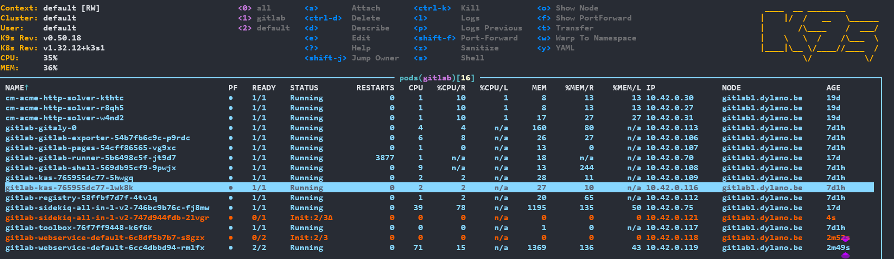

# Handy tools

## k9s

[k9s](https://github.com/derailed/k9s) is a terminal UI for managing Kubernetes clusters. It gives you a faster way to inspect pods, deployments, services, logs, and namespaces without typing `kubectl` commands all the time.

The `k9s` command is installed automatically by our automation when Kubernetes is enabled via `k8s_enabled: true`.

### Use

Start `k9s` with:

```bash
k9s
```
Some useful basics:

- Use the arrow keys to move through resources.
- Press `:` to open the command bar and switch resource types, for example `:pods` or `:deployments`.
- Press `l` to view logs for the selected pod.
- Press `d` to describe the selected resource.
- Press `0` to show all namespaces, or use `:ns` to switch namespaces.
- Press `q` to go back or quit the current screen. (or ESC / CTRL-C to quit k9s console)

`k9s` uses your current `kubectl` context, cluster access is already configured by our automation  so you can just launch it.

### Example


