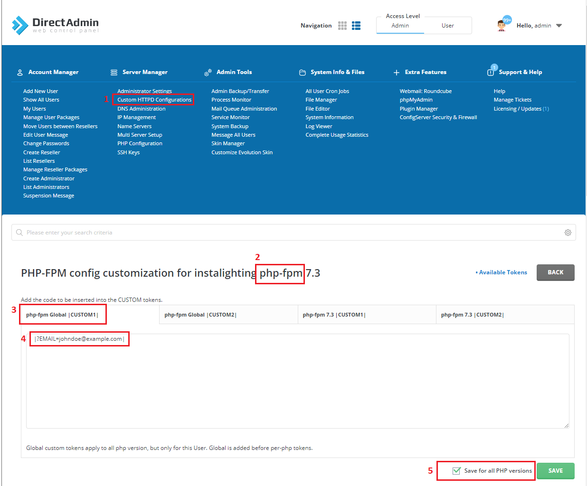

# DirectAdmin

## Introduction

DirectAdmin has very extensive [documentation](https://docs.directadmin.com/getting-started/first-steps/overview.html "DirectAdmin Official Documentation") as well as a significant amount of information on their [forum](https://forum.directadmin.com/ "DirectAdmin Official Forum"). It is most likely a very good starting point if anything is not working as expected.

## Apache reverse proxy to docker, nodeJS or any other service

It's possible to use reverse proxy on DirectAdmin quite easily, however it's important to not block for example Let's Encrypt.

We will use port **8086** as an example here, navigate as admin user to:
Server Manager >> Custom HTTPD Configurations >> "Select applicable domain" **httpd.conf** >> Customize >> Put the following code under **CUSTOM2**

```
RewriteEngine On
RewriteCond %{REQUEST_URI} !^\.well-known/(.*)
RewriteCond %{HTTPS} !=on
RewriteRule (.*) https://%{HTTP_HOST}%{REQUEST_URI} [R=301,L]

RequestHeader set "X-Forwarded-Proto" expr=%{REQUEST_SCHEME}
ProxyPreserveHost On

ProxyPass /.well-known !
ProxyPass "/" "http://localhost:8086/"
ProxyPassReverse "/" "http://localhost:8086/"
```


## Override e-mail in DirectAdmin

DirectAdmin sometimes has an unwanted default email sender address from when using a web form. There are 2 possible solutions:

* Use an SMTP connector/plugin and configure it to use localhost (Recommended)
* Override the EMAIL tag in the php fpm setting
  1. Go to Custom HTTPD Configurations
  2. Open the "php-fpm.conf" from the affected website/account
  3. Inside php-fpm Global |CUSTOM1|
  4. Add the override, for example |?EMAIL=john.doe@example.com|
  5. Make sure to apply on all php versions
  6. Hit the save button



## Disable Local Mail Delivery for a Domain

When you add a domain on your DirectAdmin server, the mail is configured to be delivered locally as a default. This can cause problems if an external provider is used to to deliver emails, because it would try to deliver locally by default, causing a message like the following:

_SMTP-error (550) Recipient could not be added (No such recipient here)._

You can easily solve this by disabling the local delivery for the mails of your domain.

To do this, log in as the user of your domain and navigate to the option 'DNS Management', found under 'Account Manager'. Here you have the option 'Modify MX records', Then uncheck 'Use this server to handle my emails'.

## Spamexperts (or other) mail / SPF failures

When using spamassisin in front of DirectAdmin, you see messages like:

```
2022-04-20 05:41:24 H=out7.antispamcloud.com [94.75.244.176] X=TLS1.2:ECDHE-ECDSA-AES128-GCM-SHA256:128 CV=no F=<info@email.ibood.com> rejected RCPT <recipient@example.com>: SPF: 123.123.123.123 is not allowed to send mail from email.ibood.com: Please see http://www.open-spf.org/Why : Reason: mechanism
2022-04-20 06:38:26 H=out7.antispamcloud.com [94.75.244.176] X=TLS1.2:ECDHE-ECDSA-AES128-GCM-SHA256:128 CV=no F=<fd_ochtendnieuws@messagent.fdmediagroep.nl> rejected RCPT <recipient@example.com>: SPF: 123.123.123.123 is not allowed to send mail from messagent.fdmediagroep.nl: Please see http://www.open-spf.org/Why : Reason: mechanism
```

This is because you need to add spamexperts to the safe senders (relayhost), this can be done as following:

edit this file: /etc/virtual/esf_skip_hosts

```
delivery.antispamcloud.com
*.antispamcloud.com
```

(Afterwards restart spamassassin)
