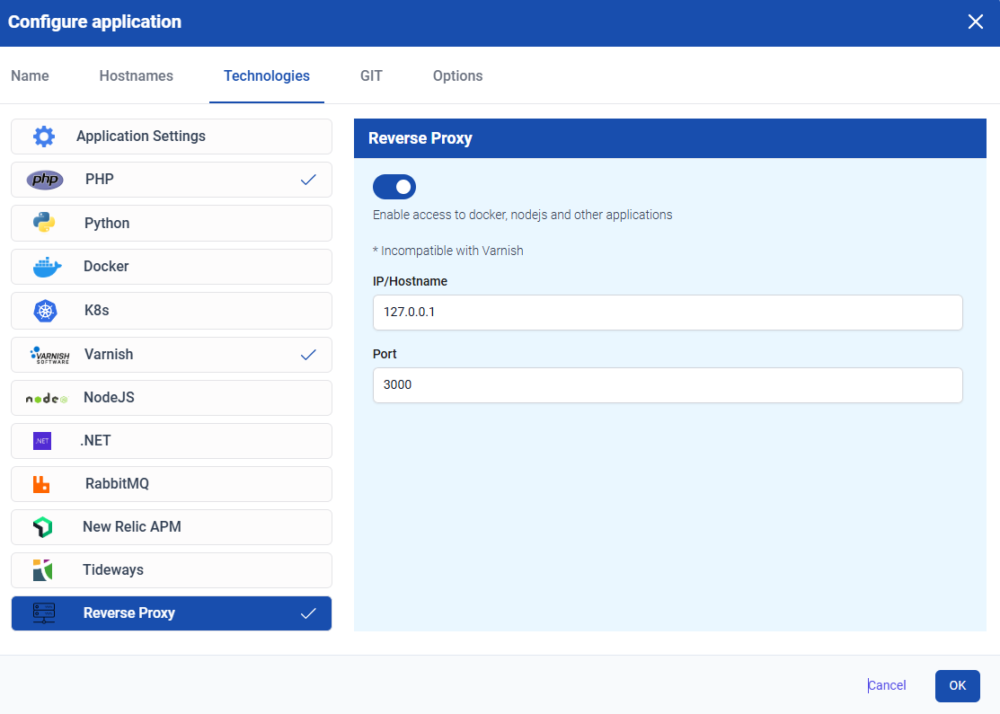

# Docker Reference Guide
In our TurboStack you have the option to host your docker containers. You can have multiple docker containers running on the same server or account.

Configuration is done on the _user_ level. This is because all users that have **Docker** enabled, are added to the docker group and have access to the relevant commands. Other users will be able to use the docker commands. 

## Configuring the server to use Docker

### Via the TurboStack GUI
You can enable Docker in the TurboStack GUI, via:

`Accounts > AccountName > Applications cogwheel > Technologies > Docker`


### Via the TurboStack YAML
You can add the following line to the account that needs docker installed:
```yaml
docker_enabled: true
```
After adding this, you can click _Save & Publish_ to start the installation.

### Configuring Proxy Upstream
Docker might not have the default ports exposed, so you might need to configure the _proxy upstream_ to make your application accessible.

You can do this configuration in the GUI, via:

`Accounts > AccountName > Applications cogwheel > Technologies > Reverse Proxy`



### Configuration example
The following configuration example shows a user that has 2 docker containers running on ports 8081 and 8082.
```yaml
system_users:
  - username: example
    vhosts:
      - server_name: dashboard.example.tld
        app_name: dashboard
        docker_enabled: true
        cert_type: letsencrypt
        proxy_enabled: true
        proxy_upstream_port: 8081
      - server_name: shop.example.tld
        app_name: shop
        docker_enabled: true
        cert_type: letsencrypt
        proxy_enabled: true
        proxy_upstream_port: 8082
```