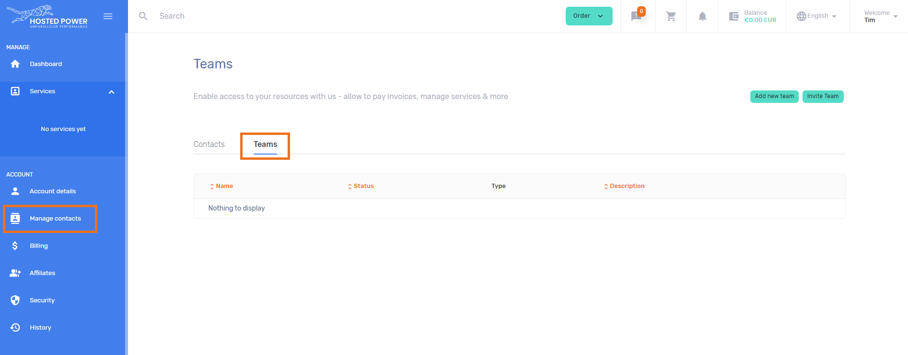
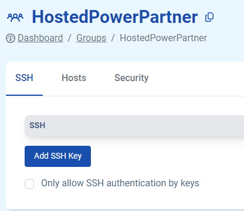
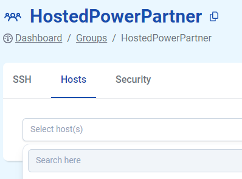
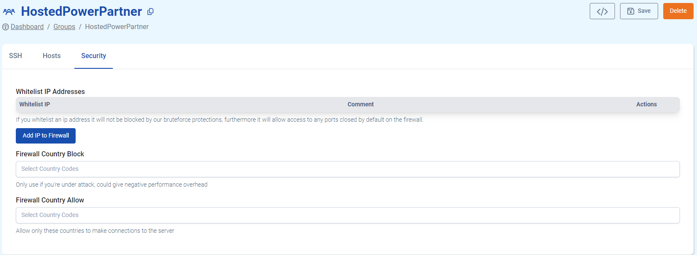

# Groups

Open the Groups tab to efficiently manage settings without the need to make changes individually for each user or project. Create partner groups, which enables you to provide SSH key access to multiple employees across different end user or partner environments.

## Where to set up Groups
In the [Customer Center](https://portal.hosted-power.com/), navigate to Manage contacts. Here you can add your relevant contacts. 
Click through to the [Teams](https://portal.hosted-power.com/profiles/teams/) tab. Here you can create your own teams, e.g. Dev, Billing, Agency, etc.

If you have a new partner requiring access to your environment, you have the possibility to invite an existing team. you can also easliy remove teams from your environment.

### Scenario 1: Use Groups for centralised user rights management with SSH keys

Centralized user rights can streamline access control and simplify administration.

* Identify the different levels of access required within your system.
* Create user groups based on these access levels. For example, you might have groups like "admin", "developers", "sysadmins", etc.
* Add users to appropriate groups based on their roles and responsibilities.
* Each user who needs access to the system should generate an SSH key pair if they haven't already.
* Have users from different groups attempt to log in using SSH keys to ensure that access is restricted according to the group-based configuration.
* Regularly review user access and group memberships to ensure that they align with your current organizational requirements.

Hosted Power monitors system logs for any unauthorized access attempts and take appropriate action if necessary.

### Scenario 2: Use Groups for centralised TurboStack Node management 

Managing TurboStack nodes using groups can help streamline operations and ensure consistency across your infrastructure.

* Determine the different roles that your TurboStack nodes will fulfill, such as web node, database node, application node, etc.
* Create groups based on the identified server roles.
* Assign each TurboStack node to the appropriate group based on its role.

## The Security Tab

