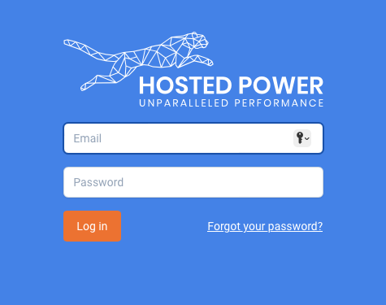
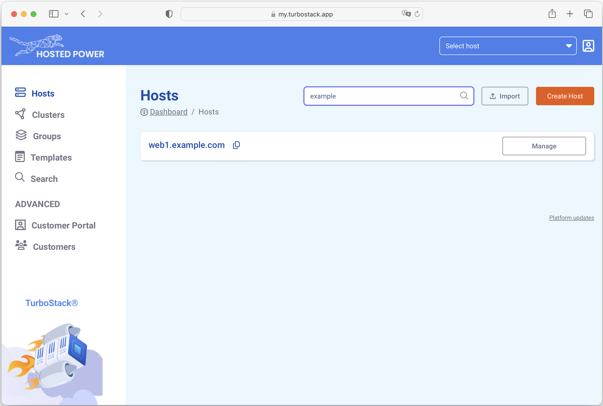
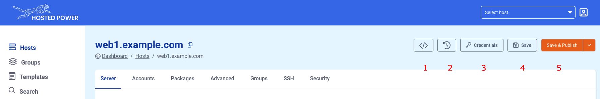
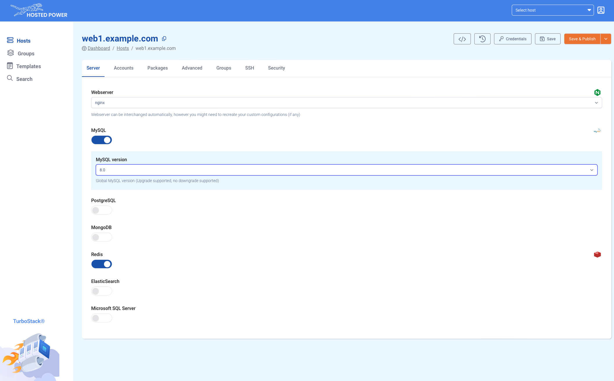
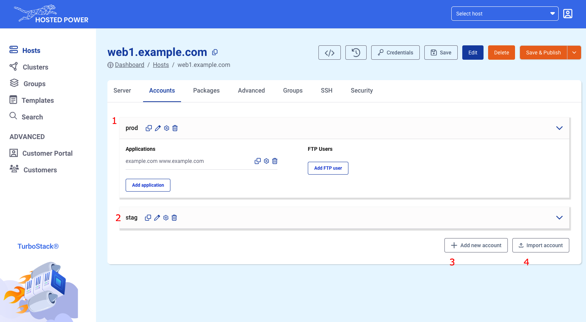
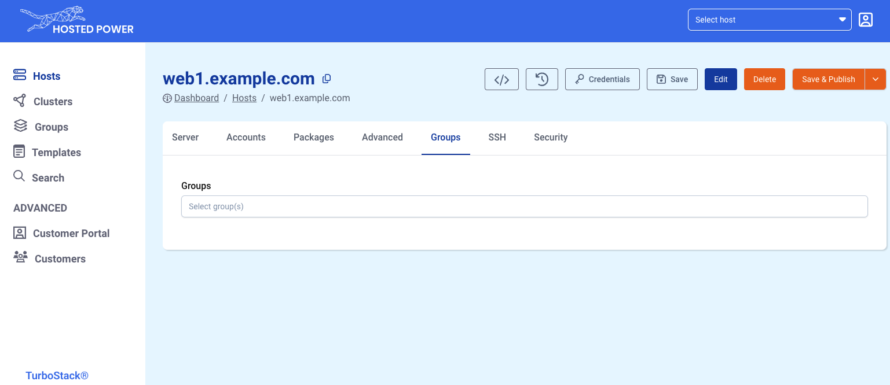
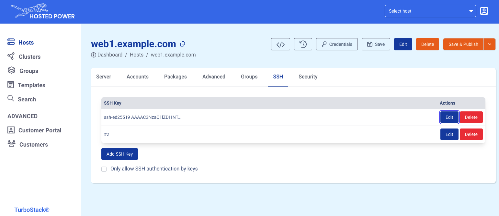
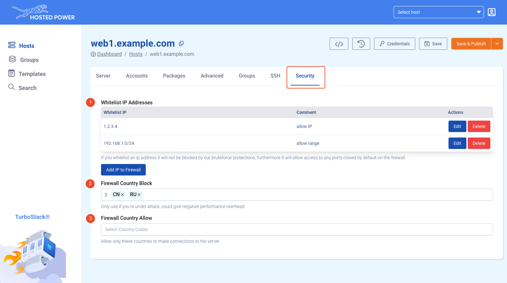

# TS App Basics

## Login and locate your managed servers

When going to the [TurboStack App](https://my.turbostack.app/ "TurboStack App") , login with your credentials for the [Customer Center](https://portal.hosted-power.com/ "Customer Center").

If you don't have a login to the Customer Center yet, you first have to create a Primary account. More info [here](https://docs.turbostack.app/#create-a-customer-profile).

Once logged in, all servers managed by this account will become visible in the **"Hosts"** tab.

## Main TurboStack App functions

For each server there are main functions available.

1. Switch between the GUI layout and the (advanced) YAML layout
2. Revisions: shows all historic configuration changes made to the server
3. Fetch the credentials and IPs of the servers all users and databases
4. Save any changes made to the configuration
5. Save and Publish: saves and deploys the changes made to the server

Under point 5, there the option to save and full publish.
This will ensure everything gets deployed.

## The 'server' tab

The **server** tab defines some basic middleware configuration, like the type of webserver and some different type of databases that are supported.

## The 'accounts' tab

The **account** tab defines the server users and the applications. Typically, a user can have one or more
applications.
In the examples below we have 2 users, `prod` and `stag`.
The prod user has an application running on the weburl `example.com` and `www.example.com`

1. Shows user `prod` and its ontaining applications
2. Shows user `stag`, with a collapsed layout
3. Will create an additional user.

## The 'groups' tab

The **groups** tab can link a server to an existing group.
Groups can define additional configuration that can then be applied to all nodes in that group. 

The groups can be used to configure SSH keys for all people in your company, these right could than also be quickly revoked on all servers in the group (for example if someone leaves the company).

Another very powerfull groups feature is that it allows to set custom settings which will apply to all servers in the group. For example it could be used to change the default timezone for all servers in the group.

## The 'SSH' tab

The **SSH** tab defines one or more public ssh keys that allow shell access to a TurboStack node without using a password.
SSH keys can be added, deleted and edited here.

You can also disable SSH password authentication completely here by activating the checkbox "Only allow SSH authentication by keys".

## The 'Security' tab

<b>This is an advanced section, use with caution</b>

 

The **Security** tab can update the server firewall. Allowing (whitelisting of) specific IPs or IP ranges.
You even have the ability to allow or block complete countries/regions.

1. Allow (whitelist) one or more IPs or IP ranges
   1. These ip's will not be blocked by any brute force protections
   2. These ip's will also have FULL access to any otherwise closed ports.
2. Block (blacklist) one or more countries
3. Only allow (whitelist) one or more countries
