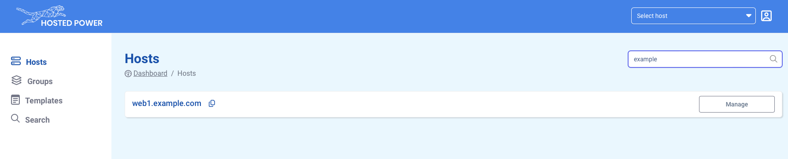

# TurboStack App Basics

## Login and locate your managed servers

When going to the [TurboStack App](https://my.turbostack.app/), 
login with credentials for [portal.hosted-power.com](https://portal.hosted-power.com/). 

Once logged in all servers managed by this account will become visible in the **"Hosts"** tab. 

## Main TurboStack App functions

For each server there are main functions available

1. Switch between the GUI layout and the (advanced) YAML layout
2. Revisions: shows all historic configuration changes made to the server
3. Fetch the credentials and IPs of the servers all users and databases
4. Save any changes made to the configuration
5. Save and Publish: saves and deploys the changes made to the server

under point 5, there the option to save and full publish.
this will ensure everything gets deployed

## The 'server' tab

the **server** tab defines some basic middleware configuration.
Like the type of webserver and some different type of databases that are supported

## The 'accounts' tab
