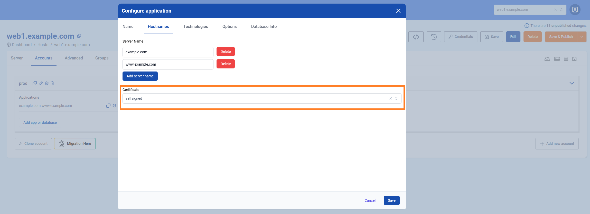

# Howto create a new user and application

## Creating a new user

Creating a new user on the [TurboStack App](https://my.turbostack.app).
Open the TurboStack app and open the server view

1. Go to the accounts page
2. Add a new account (user)
3. Give the account a name and save

## Creating a new application

Creating a new (default) application under the newly created `prod` user.  
Scenario: creating a magento2 application listening on `www.example.com` and using varnish as caching

1. Open the detail section for the user
2. Click to add a new application
3. The first application for each user should always be `default`
4. Go to `Hostnames` and 1 or more names the website should listen on
5. Choose a website SSL certificate, there are 3 options: `letsencrypt`(default), `selfsigned` and `custom`(bring your own)
6. Go to `Technologies` and set the app type that matches your application
7. Enable PHP or another technology that your application requires
8. Scroll down to enable `varnish` on our website
9. Optionally a `monitoring url` can be set that Hosted Power will monitoring 24/7.
10. Click `Save` to save and exit the configuration wizard.

Now, the new application is configured, click `Save & Publish` to deploy the configuration to the server.