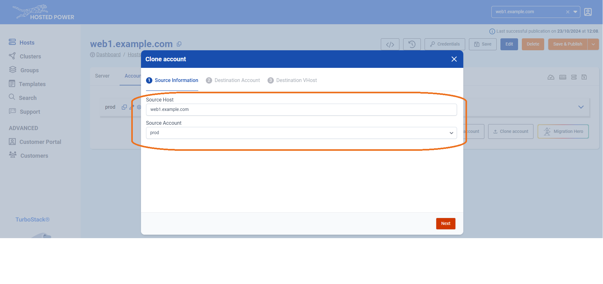

# Accounts Management

## What is an account and where is it used for?

The account is a linux user which can be used to just access the server, however you probably want to deploy one or multiple **applications** under this user. Note that we do not allow to run an application on the root user for security reasons.

Furthermore, in general, we also don't recommend to run different (types of) applications under the same user. Typically you would run several applications under one user when you have single git repo or source code folder with different applications or application endpoints.

In the [TurboStack App](https://my.turbostack.app "TurboStack App"), you can create accounts in two ways: either by creating a brand-new account or by cloning an existing one.

!!!
For staging and production instances of an application, best practice is always to use an entirely different server, because it's by design unvoidable resources allocated for staging, will be (silently) "taken away" from production. Even when this staging application is rarely used, it would still be loaded for example in database memory and other parts.
!!!

## Creating a new account

### How to deploy a new account in the GUI

Creating a new user on the [TurboStack App](https://my.turbostack.app "TurboStack App").

* Open the TurboStack App
* Open the server view

1. Go to the `Accounts` page

2. Add a new account (user)

3. Give the account a name and save

4. `Save and Publish` will deploy the change to the host


### How to deploy a new account in the source YAML [!badge icon="alert" text="Advanced"]

for more advanced users there also the YAML configuration.
adding a new account can be done with

```yaml
system_users:
  - username: prod
```


Now an account is created. Applications can be installed.

Example, [Deploy a Magento2 application](./howto_newapp.md)

## Cloning an account

To make a clone of an existing application of an existing application, we provide the `Clone Account` feature. This function replicates the entire configuration and copies the files and database, enabling a quick and efficient setup with minimal effort.

Here’s how to do it:

1. Navigate to the `Accounts` tab in the TurboStack App under your host.

2. Click `Clone Account`.

3. In the next step, select the source host. This can be either the current server or another server you manage.

4. Choose the account you want to clone, then click `Next`.

5. You'll be prompted to decide whether to copy the source account to an existing account or create a new account. Make your selection and click `Next`.

6. Select the hostname(s) you'd like to associate with the account and choose the type of certificate you want to activate. Click `Next` to finalize.


And that’s it! Your application is now cloned to a new account. Be sure to save the configuration and publish it when you're ready.


