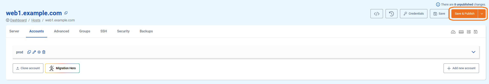
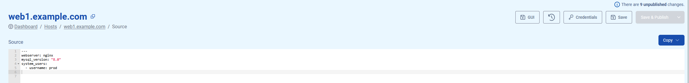

# TS Accounts Management

## Creating a new account

### What is an account and where is it used for?

The account is a linux user which can be used to just access the server, however you probably want to deploy one or multiple **applications** under this user. Note that we do not allow to run an application on the root user for security reasons.

Furthermore in general we also don't recommend to run different (types of) applications under the same user. Typically you would run several applications under one user when you have single git repo or source code folder with different applications or application endpoints.

!!!
For staging and production instances of an application, best practice is always to use an entirely different server, because it's by design unvoidable resources allocated for staging, will be (silently) "taken away" from production. Even when this staging application is rarely used, it would still be loaded for example in database memory and other parts.
!!!

### How to deploy a new account in the GUI

Creating a new user on the `<a href="https://my.turbostack.app" target="_blank">`TurboStack App `</a>`.

* Open the TurboStack App
* Open the server view




1. Go to the accounts page
2. Add a new account (user)
3. Give the account a name and save
4. `Save and Publish` will deploy the change to the host

### How to deploy a new account in the source YAML [!badge icon="alert" text="Advanced"]

for more advanced users there also the YAML configuration.
adding a new account can be done with

```yaml
system_users:
  - username: prod
```



Now an account is created. Applications can be installed.

Example, [Deploy a Magento2 application](./howto_newapp.md)
