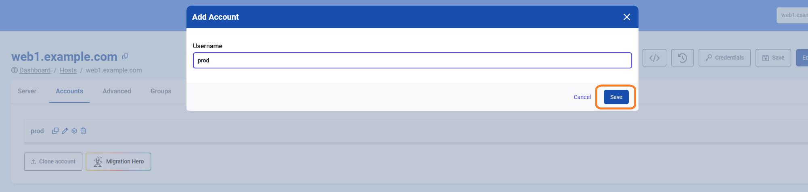
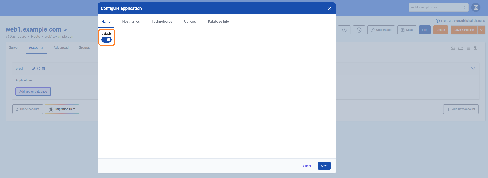
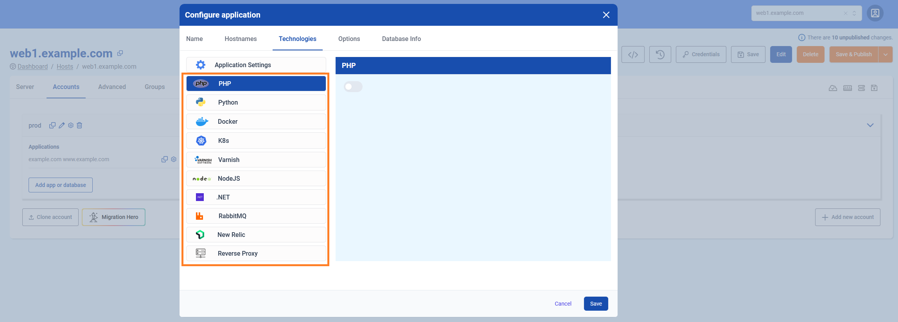

# Accounts & Application Management

## What is an account and what is it used for?

The account is a linux user which can be used simply to access the server. However, you probably want to deploy one or multiple **applications** under this user. This guide will explain how to deploy system users and all settings your application requires.

In the [TurboStack App](https://my.turbostack.app "TurboStack App"), you can create accounts in two ways: either by creating a brand-new account or by cloning an existing one.

!!!
For staging and production instances of an application, best practice is always to use an entirely different server, because it's by design unavoidable that resources allocated for staging, will be (silently) "taken away" from production. Even when this staging application is rarely used, it would still consume memory for e.g. databases, causing avoidable overhead.
!!!

## Creating a new account

### How to deploy a new account in the GUI

Creating a new user on the [TurboStack App](https://my.turbostack.app "TurboStack App").

* Open the TurboStack App
* Open the server view

1. Go to the `Accounts` page

2. Add a new account (user)

3. Give the account a name and save

4. `Save and Publish` will deploy the change to the host


### How to deploy a new account in the source YAML [!badge icon="alert" text="Advanced"]

for more advanced users there also the YAML configuration.
adding a new account can be done with

```yaml
system_users:
  - username: prod
```


Now an account is created. Applications can be installed.

## How to create a new application

* Open the TurboStack app
* Click the host view
* Select to host to update

### Prerequisite

Creating a new user on the [TurboStack App](https://my.turbostack.app "TurboStack App").
An account must exist before an application can be configured.
How to create a new [account](./howto_newuser.md)

### Creating a new application in the GUI

Creating a new (default) application under the newly created `prod` user.
Scenario: creating a Magento2 application, listening on `www.example.com` and using varnish as caching

1. Open the detail section for the user

2. Click to add a new application

3. The first application for each user should always be `default`

4. Go to `Hostnames` and 1 or more names the website should listen on
5. Choose a website SSL certificate, there are 3 options: `letsencrypt`(default), `selfsigned` and `custom`(bring your own)

6. Go to `Technologies` and set the app type that matches your application
7. Enable PHP or another technology that your application requires

8. Scroll down to enable `varnish` on our websitedat

9. When going live set a `monitoring url` so Hosted Power will monitor 24/7.

10. Click `Save` to save and exit the configuration wizard.


Now, the new application is configured, click `Save & Publish` to deploy the configuration to the server.


### Creating a new application in source code mode (YAML) [!badge icon="alert" text="Advanced"]

for more advanced users there also the YAML configuration.
adding a new application can be done with

```yaml
system_users:
  - username: prod
    vhosts:
      - server_name: example.com www.example.com
        app_type: magento2
        php_version: "8.2"
        varnish_enabled: true
        cert_type: selfsigned
```

!!! 
a system_user (e.g. `prod`) is needed before an application can be deployed
!!!


## Cloning an account

To make a clone of an existing application, we provide the `Clone Account` feature. This function replicates the entire configuration and copies the files and database, enabling a quick and efficient setup with minimal effort.

Here’s how to do it:

1. Navigate to the `Accounts` tab in the TurboStack App under your host.

2. Click `Clone Account`.

3. In the next step, select the source host. This can be either the current server or another server you manage.

4. Choose the account you want to clone, then click `Next`.

5. You'll be prompted to decide whether to copy the source account to an existing account or create a new account. Make your selection and click `Next`.

6. Select the hostname(s) you'd like to associate with the account and choose the type of certificate you want to activate. Click `Next` to finalize.


And that’s it! Your application is now cloned to a new account. Be sure to save the configuration and publish it when you're ready.


