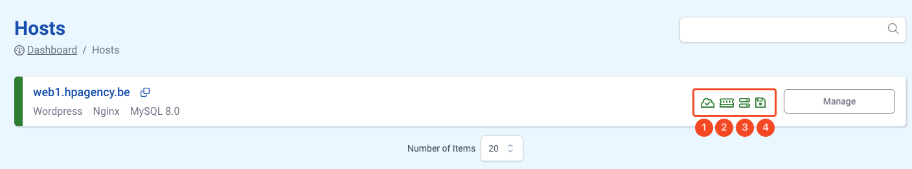

# Monitoring

Hosted Power proactively monitors your infrastructure to ensure server and service availability while simultaneously tracking resource usage. It alerts you if the load is too high, disk space is running low, or other critical thresholds are met, helping you maintain optimal performance.

The general health of the server can be seen in the TurboStack App overview:

1. IPv4 and IPv6 check and general server uptime
2. Memory and SWAP usage
3. CPU load and usage
4. Disk usage

If any of these checks alert, the icons will become red. When this is the case, please contact the Hosted Power support asap.

## Website monitoring URL

The TurboStack App is also able to monitor a website URL per application. In this case, the website URL will be added to our monitoring system
and Hosted Power will monitor the availability of the website based on the URL, and intervene 24/7 if an issue arises.

Please follow the instructions below to activate the monitoring url on your server

[!embed allowFullScreen="false"](https://player.vimeo.com/video/1056707252?title=0&amp;byline=0&amp;portrait=0&amp;badge=0&amp;autopause=0&amp;player_id=0&amp;app_id=58479)
