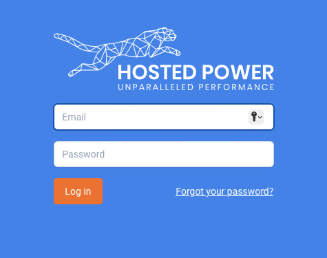
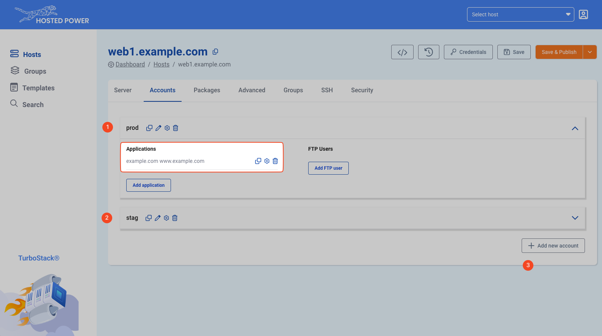
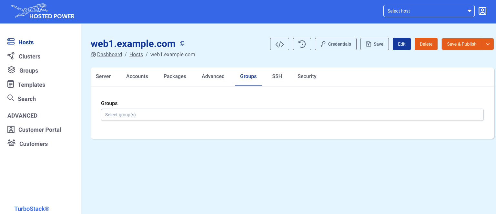
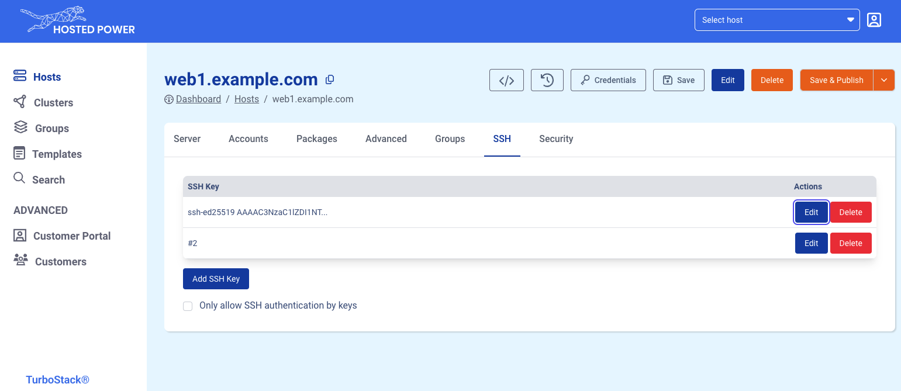

# Overview

## Login and locate your managed servers

When going to the [TurboStack App](https://my.turbostack.app/ "TurboStack App") , login with your credentials for the [Customer Center](https://portal.hosted-power.com/ "Customer Center").

If you don't have a login to the Customer Center yet, you first have to create a Primary account. More info [here](https://docs.turbostack.app/#create-a-customer-profile).

Once logged in, all servers managed by this account will become visible in the **"Hosts"** tab.

## Main TurboStack App functions

For each server there are main functions available.

1. Switch between the GUI layout and the (advanced) YAML layout
2. Revisions: shows all historic configuration changes made to the server
3. Fetch the credentials and IPs of the server's users and databases
4. Save any changes made to the configuration
5. Save and Publish: saves and deploys the changes made to the server(*)

(*) There is also an option to save & full publish. This will ensure everything is deployed, as opposed to only the changes.

## Server tab

The **server** tab defines some basic middleware configuration, like the type of webserver and several types of supported databases.

## Accounts tab

The **account** tab defines the server users and the applications. Typically, a user can have one or more
applications.
In the examples below we have 2 users, `prod` and `stag`.
The prod user has an application running on the weburl `example.com` and `www.example.com`

1. Shows user `prod` and its containing applications
2. Shows user `stag`, with a collapsed layout
3. Will create an additional user.

More info on accounts and application management can be found [Here](https://docs.turbostack.app/turbostack-app/howto_newuser/ "Here").

# Advanced tab

The **advanced** tab offers some more advanced configuration options for specific services, such as mail, Varnish, RabbitMQ, FTP, etc.

## Groups tab

The **groups** tab can link a server to an existing group.
Groups can define additional configuration that can then be applied to all nodes in that group. 

The groups can be used to configure SSH keys for everyone in your company. These rights can be quickly revoked on all servers in the group whenever necessary.

Another very powerful feature of groups is the ability to set custom settings which apply to all servers in the group. For example, it could be used to change the default timezone for all servers in the group.

More info on groups can be found [Here](https://docs.turbostack.app/turbostack-app/groups/ "Here").

## SSH tab

The **SSH** tab defines one or more public ssh keys that allow shell access to a TurboStack node without using password authentication.
SSH keys can be added, deleted and edited here.

You can also disable SSH password authentication completely by activating the checkbox "Only allow SSH authentication by keys".

## Security tab

!!!
This is an advanced section, use with caution!
!!!

The **Security** tab allows you modify the certain firewall settings.

1. Allow (whitelist) one or more IPs or IP ranges
   1. These IPs will not be blocked by any brute force protections
   2. These IPs will also have FULL access to any otherwise closed ports.
2. Block (blacklist) one or more countries
3. Only allow (whitelist) one or more countries