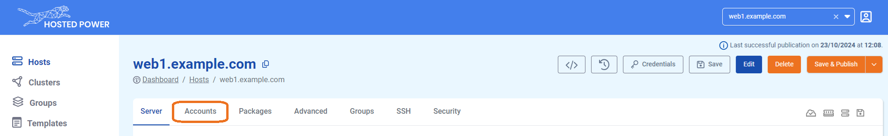
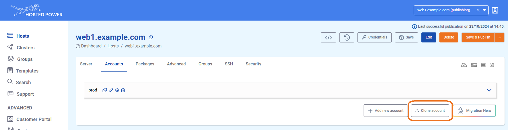
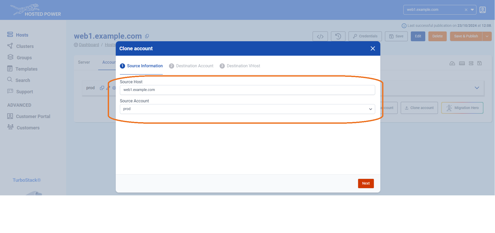
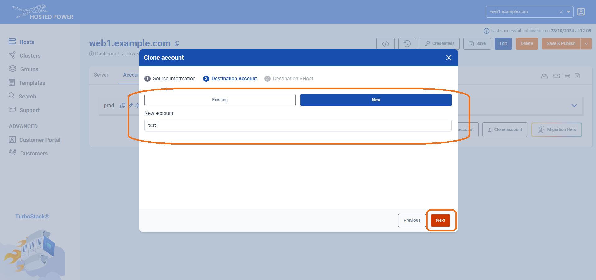
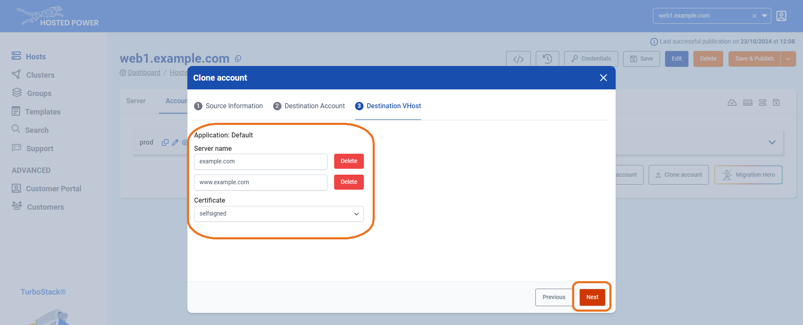
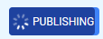
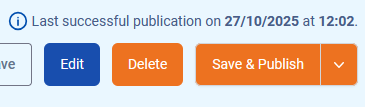

#  Cloning an application

To make a **clone of an existing application**, we provide the **Clone Application** feature. This function **replicates the entire configuration** and  optionally **copies the files and/or database**, enabling a quick and efficient setup with minimal effort.

!!!Info
This feature is extremely useful to quickly copy your production environment to a staging environment or vice versa!
!!!

## What gets copied?

What this function copies:
- User files, symlinks and their permissions.
- Database.

What this function does not do:
- Update credentials in `.env` files.
- Update the **base URL** for your application.
- Update **absolute paths** in your code or crons.

Some manual small adjustments are still needed after cloning the account, such as updating the **database credentials** in the application's `.env` file and the **base URL** for your application.

In case your application uses Redis, you'll need to update the Redis database number and/or key prefix, so the new keys are not saved in the keyspace of the original application.

If something does not work correctly, we recommend checking your application's error logs for clues.

## How to clone an application

1. Navigate to the **Applications** tab in the TurboStack Platform under your host.

2. Click **Clone Application**.

3. In the next step, select the **source host** and the **application** you want to clone. This can be either the current server or another server you manage.

4. Choose the **destination application**, which can be either an **existing** or a **new application**, and choose whether to clone the **database** and/or **files**. Click **Next**. 

5. Select the **hostname(s)** you'd like to associate with the application and choose the type of certificate you want to activate. Click **Next** to finalize.

6. The server will now clone the application, indicated by the **publishing** indicator in the top left.

7. If the application clone has succeeded, it will be indicated in the top right with a timestamp.

