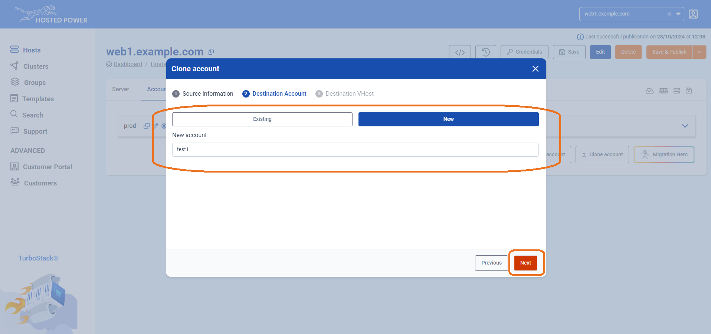
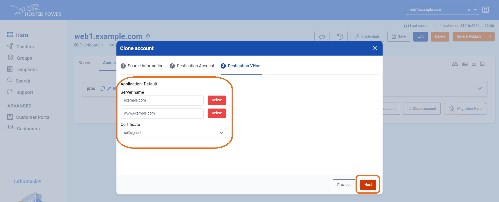

#  Cloning an account

To make a clone of an existing application, we provide the **Clone Account** feature. This function replicates the entire configuration and copies the files and database, enabling a quick and efficient setup with minimal effort.

!!!Info
This feature is extremely useful to quickly copy your production environment to a staging environment or vice versa!
!!!

Here’s how to do it:

1. Navigate to the **Accounts** tab in the TurboStack Platform under your host.

2. Click **Clone Account**.

3. In the next step, select the **source host** and the **account** you want to clone. This can be either the current server or another server you manage.

4. Choose the **destination account**, which can be either an **existing** or a **new account**, and choose whether to clone the **database** and/or **files**. Click **Next**. 

5. Select the **hostname(s)** you'd like to associate with the account and choose the type of certificate you want to activate. Click **Next** to finalize.

6. The server will now clone the account, indicated by the **publishing** indicator in the top left.

7. If the account clone has succeeded, it will be indicated in the top right with a timestamp.

And that’s it! Your application is now cloned to a new account. Be sure to save the configuration and publish it when you're ready.