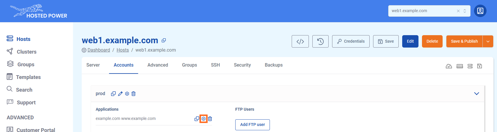
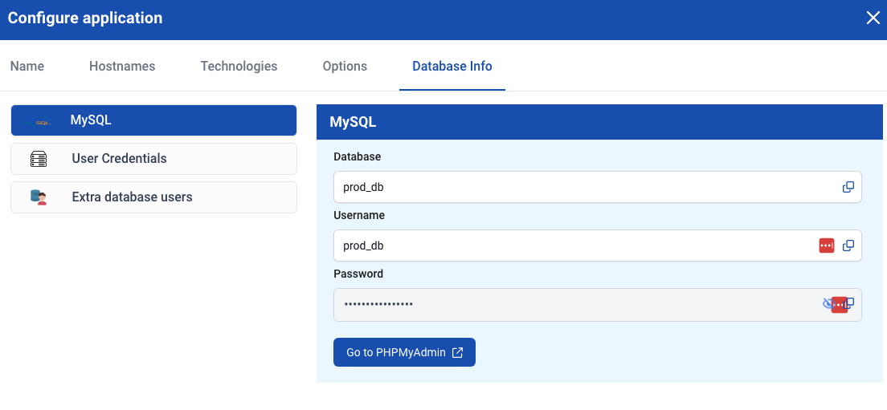
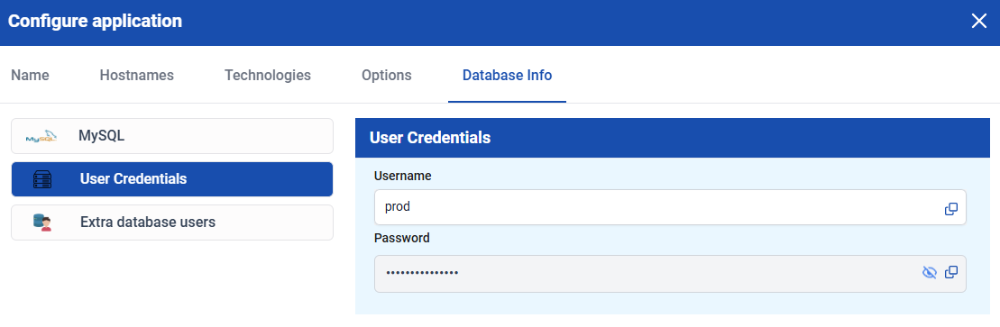

## Fetching database and user credentials

!!!
Make sure you have already created an existing user with a successful publish.
!!!

You can fetch the credentials from the application you just created.
To do this, click on the gear icon next to the user and navigate to the **Database Info** tab.

To get database credentials:

To get user credentials:

