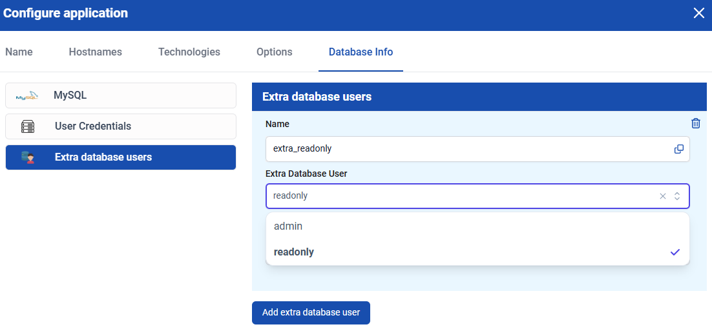

## Adding extra database users

It is possible to add an **additional database user** with **read-only** or **admin** access to a databases. You can also retrieve the **credentials** for this user.

**admin**: Full access to ALL server databases.  
**read-only**: Read-only access to the specific application database.