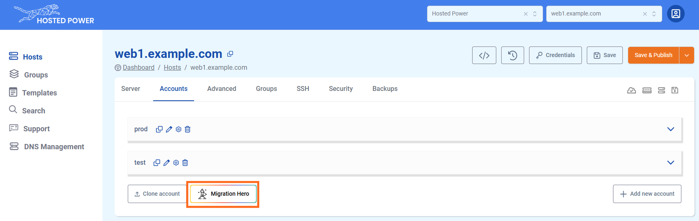
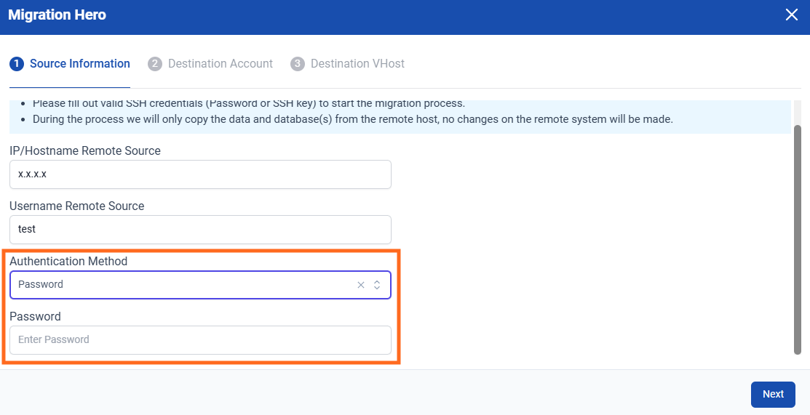
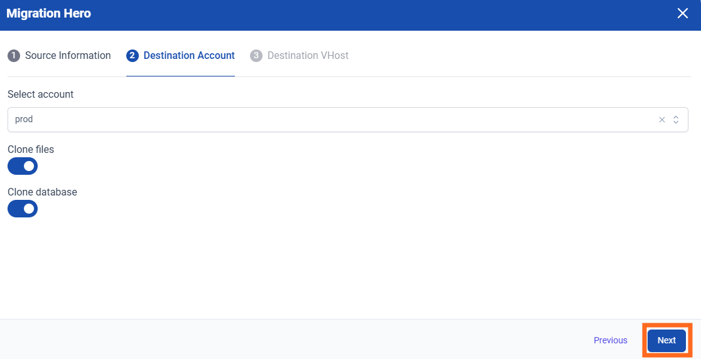
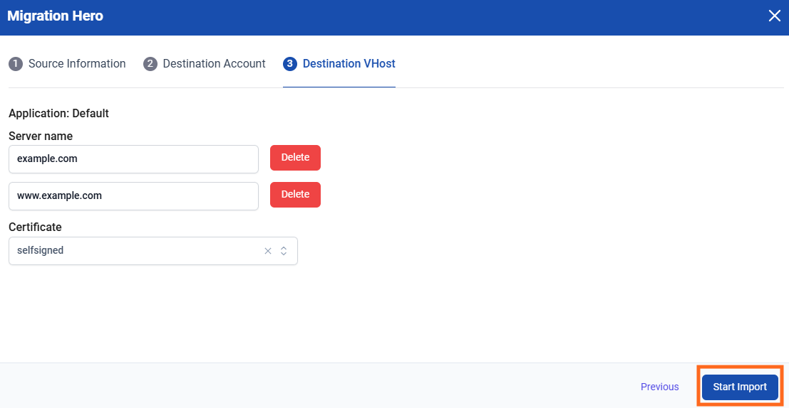

# Migrating your application to TurboStack with Migration Hero

To simplify the migration of your external application to TurboStack, the **Migration Hero** feature is available. It automatically transfers the full configuration, files and database. Enabling a fast and efficient setup with minimal effort.

!!! info
Before starting, make sure you have already created an application and successfully performed a **Save and Publish**.

If you want to migrate an application from TurboStack to TurboStack, please use the **Account Cloning** feature documented below.
!!!

Here’s how to do it:

1. Navigate to the `Accounts` tab in the TurboStack Platform under your host.

2. Click `Migration Hero`.

3. In the next step, enter the remote host and the user you want to migrate. 
Then, choose the authentication method you want to use to connect to the remote host.

4. **Option 1:** Enter the password for the user on the remote host, then click `Next`.

5. **Option 2:** Generate and add the provided public SSH key to the `.ssh/authorized_keys` file on the remote host, then click `Next`.

6. Choose the destination account (it must be an existing one) and select whether to migrate the database, files, or both. Then click `Next`. 

7. Select the hostname(s) you want to associate with the account and choose the type of certificate to activate. Click `Start Import` to begin the migration.

8. A migration progress popup will appear in the bottom-right corner. Once it finishes, your migration is complete. 

