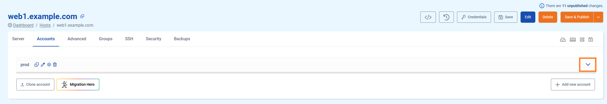
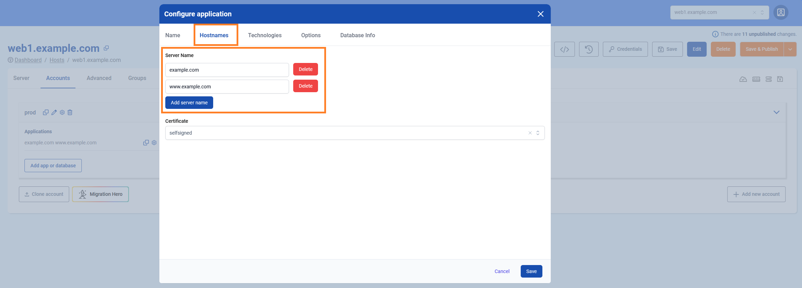
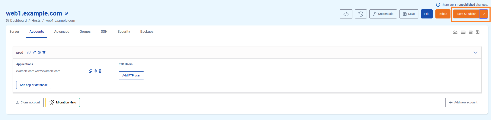
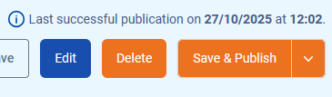
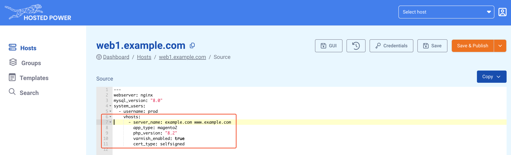

# Setup

This article explains how to set up your application environment from scratch. If you want to replicate an existing environment, or want to migrate an application from an external server to TurboStack, please consult the [Account Cloning](accountclone.md) and [Migration Hero](migrationhero.md) articles respectively.

!!! info
New servers can also be auto-configured using **Templates**! Visit [this](../../templates.md) page for more information.
!!!

## What is an account and what is it used for?

The account is a linux user which can be used simply to access the server. However, you probably want to deploy one or multiple **applications** under this user. This guide will explain how to deploy system users and all settings your application requires.

!!!
For staging and production instances of an application, best practice is always to use an entirely different server, because it's by design unavoidable that resources allocated for staging, will be (silently) "taken away" from production. Even when this staging application is rarely used, it would still consume memory for e.g. databases, causing avoidable overhead.
!!!

## Creating a new account

### Deploying a new account in the GUI

Creating a new user on the [TurboStack Platform](https://my.turbostack.app "TurboStack Platform").

* Open the TurboStack Platform
* Open the server management console in the **Hosts** section

1. Go to the **Accounts** page

2. Click **Add new account**

3. Give the account a **username** and save

4. **Save and Publish** will deploy the change to the host

### Deploying a new account in the source YAML [!badge icon="alert" text="Advanced"]

Advanced users can also deploy an account in the source YAML:

```yaml
system_users:
  - username: prod
```


More info on using the YAML editor can be found [here](../yaml.md).

## Creating a new application

### Creating a new application in the TurboStack Platform GUI

Creating a new (default) application under the newly created **prod** user.

1. Open the detail section for the user.

2. Click **Add app or database**

3. The first application for each user should always be **default**.

4. Fill in 1 or more **hostnames** your application will listen on.

5. Choose an **SSL certificate**, there are 3 options: **letsencrypt**(default), **self-signed** and **custom** (3rd party certificate).

!!! info
Let's Encrypt certificates can only be validated if the selected hostnames already have the proper DNS settings to point them to the server. If this condition is not met, the validation will fail, and publishing will throw an error! If you cannot adjust DNS, but you do need HTTPS, you can choose a self-signed certificate and change it to Let's Encrypt whenever you're ready. 
!!!


6. Go to **Technologies** and set the app type that matches your application.


!!! info
The **app type** should match the CMS or framework that will be installed on this environment, and automatically applies some application-specific configuration. Can't find your CMS of framework in this list? Contact us!
!!!

7. Enable all **technologies** that your application requires. This section is updated regularly, so keep an eye on our [changelog](../../changelog.md)!

8. When going live, set a **monitoring url** so Hosted Power will monitor 24/7.

9. Click **Save** to save and exit the configuration wizard.

10. Finally, click **Save & Publish** to push your configuration to the server.


Please note that two more publishing options are available:

- **Save & Full Publish**: Redeploy the whole server configuration as opposed to only the changes
- **Save, Delete & Full Publish**: Same as **Save & Full Publish**, but is required when **explicitly deleting** certain configs. You will be prompted to verify this option by typing 'DELETE' as a failsafe.


Depending on the volume and impact of changes, publishing can take some time! When the publication of your TurboStack has completed successfully, a message indicating so with a timestamp will appear in the top right corner:



### Creating a new application in source code mode (YAML) [!badge icon="alert" text="Advanced"]

Advanced users can also deploy an application in the source YAML:

```yaml
system_users:
  - username: prod
    vhosts:
      - server_name: example.com www.example.com
        app_type: magento2
        php_version: "8.2"
        varnish_enabled: true
        cert_type: self-signed
```



More info on using the YAML editor can be found [here](../yaml.md).


