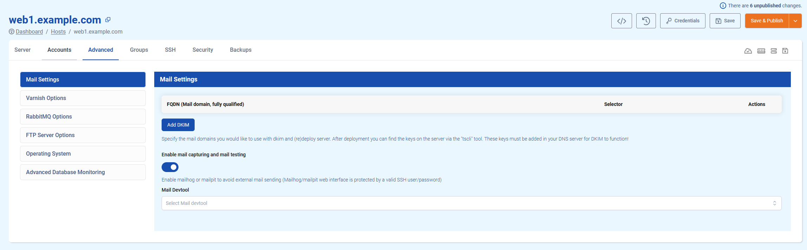
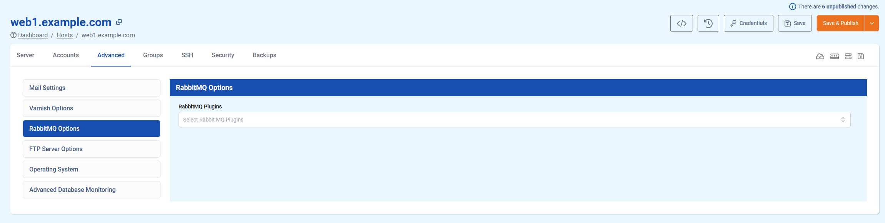
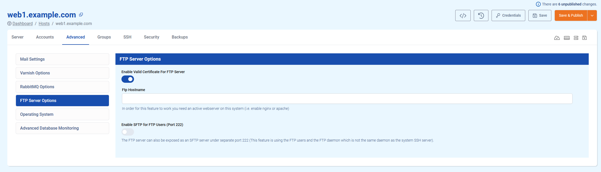

# Advanced tab

The **advanced** tab offers some more advanced configuration options for specific services, such as mail, Varnish, RabbitMQ, FTP, etc. This article describes the options currently available.

## Mail Settings

### DKIM

**DKIM (DomainKeys Identified Mail)** is an email authentication method that helps prevent email spoofing. It works by adding a **digital signature** to outgoing messages, which receiving mail servers can verify using the **public key** published in the sender’s domain DNS records. This sections allows you to easily set up DKIM for your mail domain.

1. Fill in the **FQDN (Fully Qualified Domain Name)**, which is the domain you want to mail from.
2. Choose a **selector** for the DKIM record. This selector will be used as the **subdomain** part of the record.
3. SSH to the server and use the command `tscli dkim records` to **acquire your DKIM record**.
4. **Create the DKIM record** in your domain's DNS settings
5. SSH to the server and use the command `tscli dkim validate` to **check if the DNS record was created correctly**.
6. All done!

!!! info
DKIM is part of your domain's **mail deliverability** optimisation. For more information on mail deliverability, take a look [here](../../Configuration/Mail/deliverability.md).
!!!

### Mail Devtool - Enabling mail capturing and mail testing

TurboStack allows you to use either **Mailpit** or **Mailhog** to test your mailing. Once activated, you can reach the GUI through the URLs `https://<hostname>/mailpit` or `https://<hostname>/mailhog` respectively. Here, a **basic auth prompt** will appear, where you can enter the [system user's credentials](Accounts/credentials.md).

!!! info
We currently recommend Mailpit over Mailhog, as the Mailhog project is no longer receiving updates!
!!!

## Varnish Options

### Varnish Cache Size

This value determines the **amount of memory** that can be used by Varnish to **store cached content**. The default setting **auto-scales** based on your server flavour, but can be set to a size of your preference.

### Use your own Varnish custom VCL

Your Varnish is set up to use a **default VCL** (Varnish Configuration Language) based on and optimised for your selected **app type**. However, you can use **your own VCL** if you wish. To do so, toggle this option on and add your VCL file to the directory `/etc/varnish/conf.d/` on your server.

### Varnish Flavor

Choose between the **Open Source** and **Enterprise** versions of Varnish. The Open Source flavor is free, while the Enterprise version requires you to buy a **separate license**. 

The Open Source flavor includes an option to **enable Varnish modules**.

## RabbitMQ Options

The RabbitMQ Plugins options allows you to easily **install RabbitMQ plugins**.

## FTP  Server Options

### Enable Valid Certificate For FTP Server 

**Generate an SSL certificate** for FTP connections using a **ostname of your choice**. This hostname must point to the server IP in order to work!

### Enable SFTP for FTP Users

**Enables SFTP connections** over **port 222** using the existing FTP daemon and users. This does not work over port 22, as this is reserved for the SSH service.

## Operating System

### OS Extra Packages

A non-exhaustive **list of packages** available for **automated installation**. Please note this list is not complete, and more options are available when using source YAML mode! More info on editing YAML can be found [here](yaml.md)

### Maintenance Window

Set a maintenance window for **patches and updates** that require rebooting the server. This allows you to choose your **least critical timing** for essential updates.

## Advanced Database Monitoring

Allows you to set up the database monitoring tool **PMM (Percona Monitoring and Management)** on your TurboStack. 

If you have a PMM advanced database analytics system, you can fill in the **PMM master server's hostname** to link your TurboStack server to it. The **PMM Sampling Rate** can be set in Advanced Settings.

More information on PMM can be found [here](https://docs.percona.com/percona-monitoring-and-management/3/index.html).