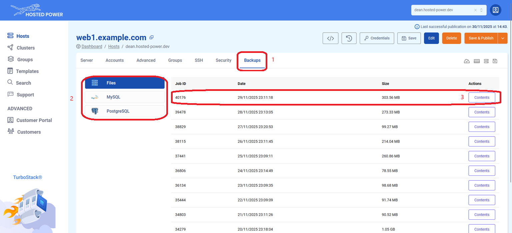
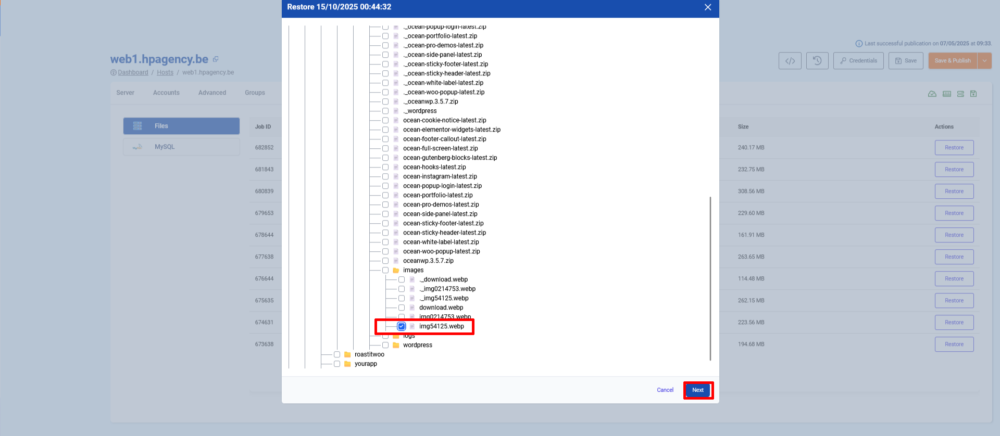
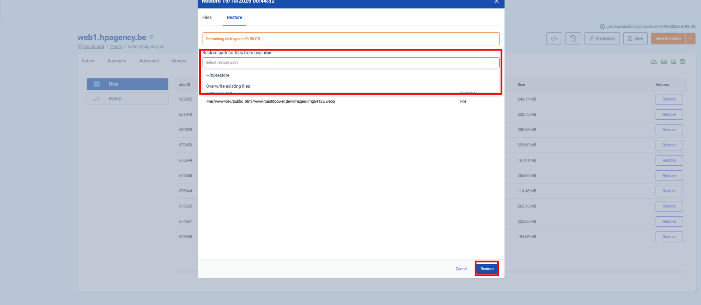
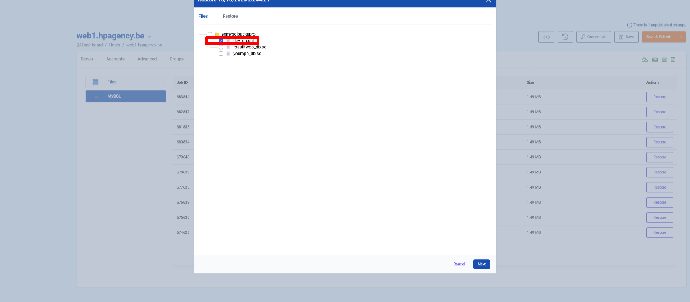
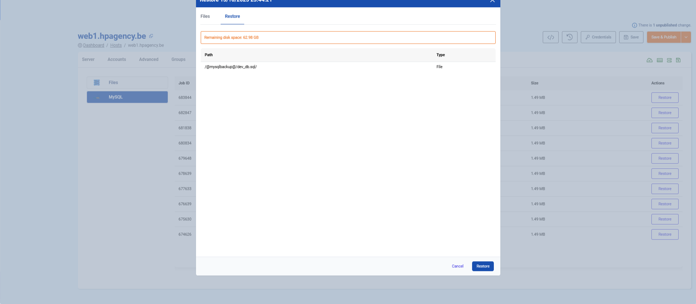

# Backups tab

The **Backups** tab is where you can restore files, folders and databases. This article will explain how you can use the backup tab. Restores for **files**, **folders**, **MySQL** and **PostgreSQL** are supported.

!!! info
This feature allows you to overwrite the existing files, folders or databases, or place the backup in a location of your choice. This procedure is described in full below.
!!!

1. Select the Backups tab at the top.
2. On the left side you can select whether you want to restore a file/folder or a database.
3. Select the date which you wish to restore the backup from and click on "contents".

## Restoring a file/folder

After clicking the "contents" button, a file tree will show up. Here you can search for the file/folder you are looking for. Once you have selected the file/folder you wish to restore click "Next".

### Restore path

The last step is selecting the restore path. You can choose to overwrite the existing file/folder or have them restored in a folder called "hprestore" in the homedirectory (~/hpresore). Select the option that you prefer in the dropdown afterwards click "Restore". After clicking on "Restore" you can check the server and the restore should be succesfull. It may take some time according how large the restore files are.

## Restoring a database

After clicking the "contents" button a list with databases will show up. Select the database you wish to restore and click "Next".

### Database restore path
The final screen will show you an overview where the database dump will be restored to. Click restore and the database dump will apear in the ~/hprestore folder of the user that owns the database.

A database will always be restored to ~/hprestore of the user which owns the database. **A database will never overwrite an existing database, importing has to be done manually.** After clicking "Restore" the restore job will start. Duration will vary according how large the restore job is.
