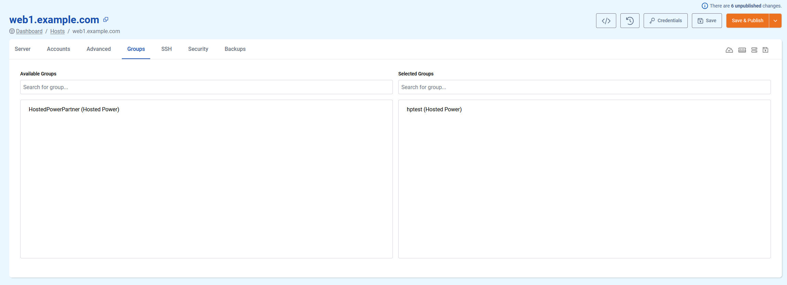

# Groups tab

Groups make it possible to **apply certain settings across multiple TurboStack nodes**, such as time zones or SSH key access. 

This section of the **Hosts** management allows you to **apply or remove Groups** you have created separately to and from the current server. More info on what **Groups** are and how to manage them can be found [here](../groups.md).