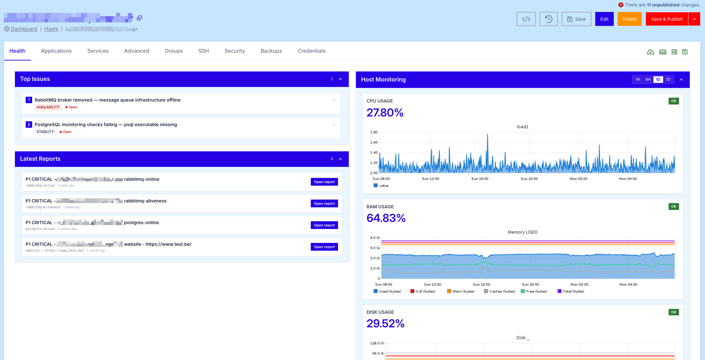
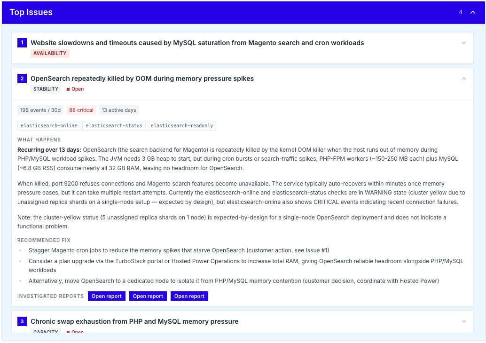
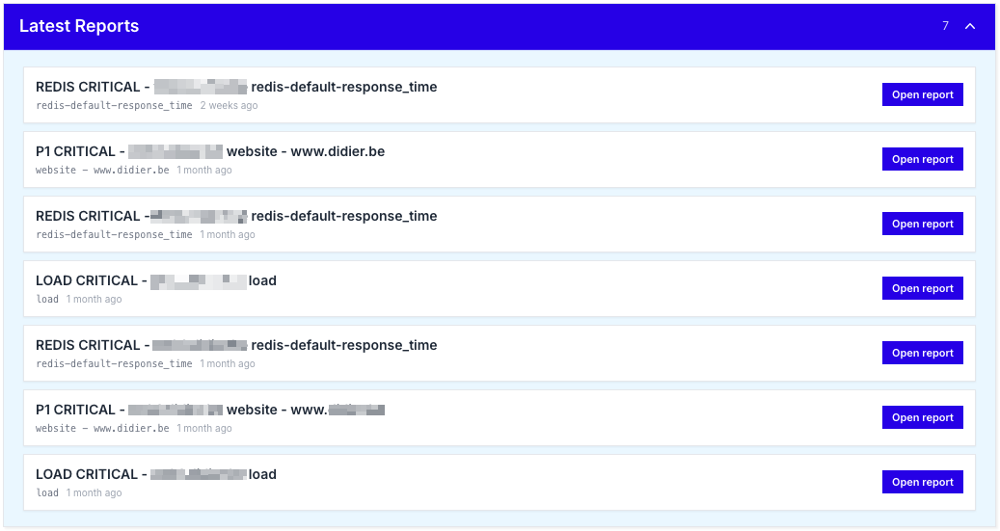

# Health - server health and monitoring overview

The **Health** tab is your **first stop** when opening a host. It provides a **real-time overview** of the server's condition, surfaces the most important **alerts**, and gives you direct access to detailed monitoring **reports** and **services**.

Unlike the fleet-wide [Monitoring dashboard](../monitoring.md), the Health tab is fully **scoped to a single host**, giving you **deep insight** into how this specific server and its applications are behaving right now and over time.

What makes the Health tab particularly powerful is that it does not just **show the status** of your server - it actively helps you **resolve issues**. For every entry in **Top Issues** and every report under **Latest Reports**, the TurboStack platform provides a **detailed analysis** of the underlying problem, together with **concrete, context-aware recommendations** on how to fix it. This turns the Health tab from a passive status page into an **actionable troubleshooting tool**, helping you move from *"something is wrong"* to *"here is exactly what to do about it"* in a single click.

This page describes every section of the Health tab and how to use it to keep your infrastructure running smoothly.

## Host Monitoring

The **Host Monitoring** panel, located on the top right, displays the most important **resource metrics** of your server at a glance:

- **CPU Usage** - the current CPU load, accompanied by a graph showing the `load1` average over time.
- **RAM Usage** - the current memory consumption, with a detailed breakdown of used, free, cached, warning and critical thresholds.
- **Disk Usage** - the current disk consumption on the root filesystem, plotted against warning and critical thresholds.

Each metric is shown as a percentage, combined with a colour-coded **status indicator** (OK, Warning, Critical) so you can immediately spot any resource that needs attention.

### Timeframe selector

In the top right corner of the Host Monitoring panel, you can switch the timeframe of the graphs between **1H**, **8H**, **1D** and **7D**. This allows you to quickly **zoom in** on a recent spike or **zoom out** to identify longer-term trends in resource usage.

!!! info
The Host Monitoring graphs are based on the same data used by our 24/7 monitoring system. If a metric crosses a critical threshold, our team will be alerted automatically.
!!!

## Top Issues

The **Top Issues** panel, on the top left, lists the **most important active alerts** on your server right now. Each issue is tagged with a **category** (e.g. `AVAILABILITY`, `STABILITY`, `PERFORMANCE`) and a **status** (e.g. `Open`).

Clicking an issue **expands** it, revealing:

1. A **detailed description** of the problem, including the affected service and the impact on your environment.
2. A **proposed solution** suggested by the TurboStack platform, based on the type of issue and the server's configuration.

This makes it easy to understand **what is wrong**, **why it matters**, and **what to do next**, without having to dig through logs or external dashboards.

## Latest Reports

Below the Top Issues panel, the **Latest Reports** section provides a chronological list of **detailed health reports** generated for the server and its applications.

Each report is linked to a specific check (e.g. `rabbitmq-online`, `postgres-online`, `website`) and includes the **severity level** (e.g. `P1 CRITICAL`), the **affected host or URL** and the **time the report was generated**.

Click **Open report** on any entry to view the full report, including timestamps, related metrics and historical context. This is particularly useful when investigating **incidents** or preparing a **post-mortem**.

## Services

At the bottom of the Health tab, the **Services** panel shows a complete list of every **monitored service** on the server, together with its current **status** and the **latest check output**.

For each service you will see:

- The **service name** (e.g. `postgres-online`, `ping4`, `disk /`, `smtp`, `mysql-uptime`).
- The **status** (`OK`, `WARNING`, `CRITICAL`, `UNKNOWN`).
- The **plugin output**, which contains the raw result of the check (e.g. response times, free disk space, error messages).
- The **timestamp** of the most recent check.

This view gives you an exhaustive overview of **everything we monitor** on your server, making it easy to confirm that all services are healthy or to drill down into a specific check that is failing.

!!! info
If a service is in an `UNKNOWN` or `CRITICAL` state and you are not sure how to resolve it, please contact our [Support](../../Support/standard_support.md) team. Our engineers have access to the same monitoring data and can intervene 24/7. See our [24/7 monitoring and alerting](../../Support/monitoring.md) overview for how this works.
!!!
