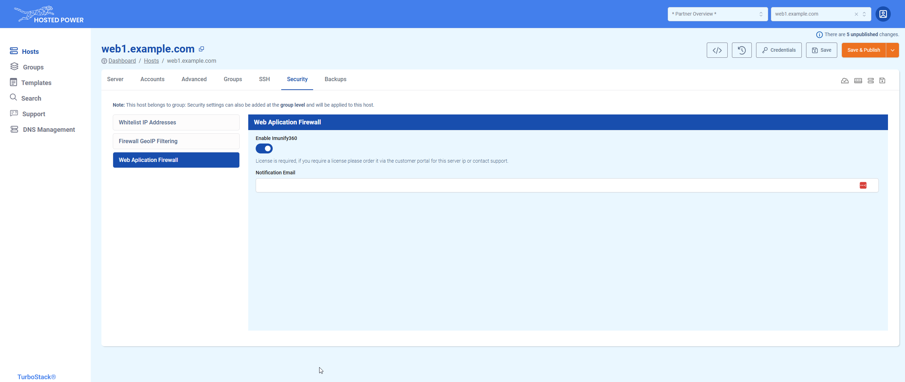

# Security tab

This is an advanced feature, please be cautious while changing values here.

The **Security** tab allows you to modify certain firewall settings.

## Whitelist IP Addresses

Here you can allow important IP adresses or range for your application.

For example:
* Your office IP
* Deployment server
* External service

A whitelisted IP will not be blocked by any _brute force_ protections and has access to any otherwise closed ports.

## FireWall GeoIP Filtering
Use this to explicitly allow or block whole countries. It's important to know that if you **allow** one or more countries, the rest will be blocked. 

You can search by either country code or the name of the whole country.

## Web Application Firewall
Here you can enable Imunify360 on your TurboStack server and configure the incident notification email address.

