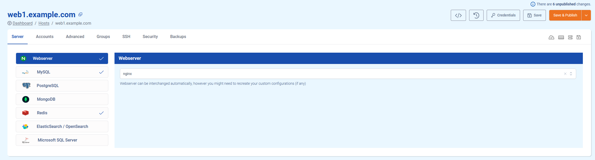
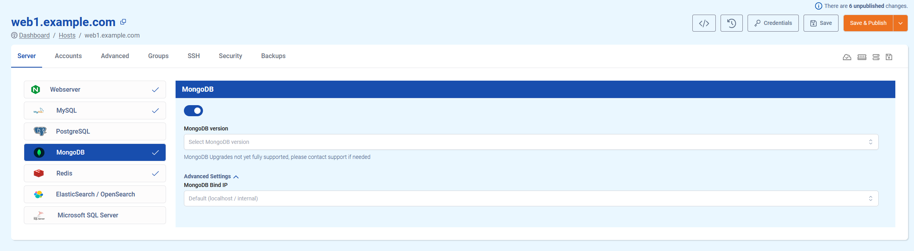

# Server tab - setting up server-wide services

The **server** tab defines some basic middleware configuration, like the type of **webserver** and several types of supported **databases**. This page describes all configuration options within the server tab.

## Webserver

We offer both **nginx** and **Apache2** as web server options. For **optimal performance** and **efficiency**, Nginx is our default choice, though Apache2 remains fully compatible and performs reliably on our TurboStack.

## MySQL

This option allows you to set up a server-wide MySQL instance with your preferred version. It also features some more advanced settings.

### MySQL Bind Address

By default, MySQL is only reachable from localhost (127.0.0.1) for security reasons. If for any reason you need external access, you can set the BIND address to 0.0.0.0, or a default local IP of your choice. 

!!! info
Setting the BIND address to anything other than localhost does NOT allow access from any WAN IP! Only whitelisted IP addresses have remote database access. For IP whitelisting options, see the Security tab.
!!!

### InnoDB Size

The InnoDB buffer pool size is a memory allocation setting that defines how much RAM InnoDB can use to cache data and indexes for tables. It’s crucial for performance, as a larger buffer pool means more data can be served from memory instead of disk, resulting in faster queries.

The default setting is optimised for your specific server flavour. However, you can allocate a custom amount of memory if needed.

## PostgreSQL

This option allows you to set up a server-wide PostgreSQL instance with your preferred version. It also features some more advanced settings.

### PostgreSQL Listen Addresses

Similar to MySQL, PostgreSQL is only reachable from localhost (127.0.0.1) for security reasons. If for any reason you need external access, you can set the listen addresses to 0.0.0.0, or a default local IP of your choice. 

!!! info
Setting the listen addresses to anything other than localhost does NOT allow access from any WAN IP! Only whitelisted IP addresses have remote database access. For IP whitelisting options, see the Security tab. Furthermore, PostgreSQL Extra Access must be configured, which is described below.
!!!

### PostgreSQL Shared Buffers

This is a PostgreSQL memory area used to cache frequently accessed data pages from the database, reducing disk reads and improving query performance. It typically works alongside the operating system’s file cache for efficient data access.

The default setting is optimised for your specific server flavour. However, you can allocate a custom amount of memory if needed.

### PostgreSQL Extra Access

To enable remote access to your PostgreSQL instance, aside from a listen address and IP whitelisting, PostgreSQL Extra Access must be defined. Here, you can choose Type as a description, the database and user you want to connect with, the IP address (range) you want to connect from, and your preferred authentication method (usually md5).

## MongoDB

This option allows you to set up a server-wide MongoDB instance with your preferred version. It also features some more advanced settings.

### MongoDB Bind IP

Similarly to MySQL, MongoDB is only reachable from localhost (127.0.0.1) for security reasons. If for any reason you need external access, you can set the BIND address to 0.0.0.0, or a default local IP of your choice. 

!!! info
Setting the BIND address to anything other than localhost does NOT allow access from any WAN IP! Only whitelisted IP addresses have remote database access. For IP whitelisting options, see the Security tab.
!!!

## Redis

This option allows you to set up a server-wide Redis service. 

This section also allows a memory allocation setting. The default setting is optimised for your specific server flavour. However, you can allocate a custom amount of memory if needed.

## ElasticSearch / OpenSearch

Both ElasticSearch and OpenSearch are available out-of-the-box on every TurboStack.

Here, you can select your preferred version, the heap size, and plugins if needed. Heap size is scaled based on your server flavour by default, but can be set manually if needed.

## Microsoft SQL Server

TurboStack supports .NET core natively within its Linux environment, which includes Microsoft SQL Server (MSSQL). 

This section allows you to select a specific MSSQL version, as well as your preferred edition.

