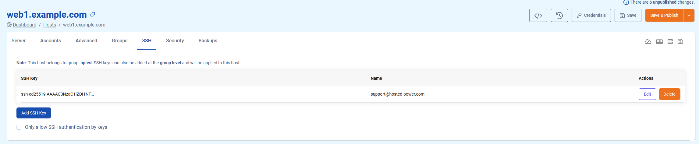

# SSH tab

This tab allows you to add your **SSH public key** to the server, enabling keypair authentication for SSH.

We recommend toggling the option **Only allow SSH authentication by keys** on when all SSH keys have been added. This provides **extra security**, even when your system user credentials have been compromised!

Need help creating your SSH key, or need help deploying your key(s) on cPanel or Directadmin? Have a look [here](../../Miscellaneous/ssh.md)!

!!! info
If deploying multiple SSH keys, please consider using [Groups](../groups.md)! This allows centralised access management over all servers, eliminating the need to control access on your servers separately.
!!!