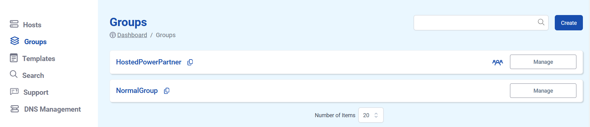

# Groups

Groups make it possible to apply certain settings across multiple TurboStack nodes, such as time zones or SSH key access.

## Normal group vs Partner group

You can differentiate between normal and partner groups. The partner group, will have a blue group icon visible next to the _Manage_ button.

### Normal group

A normal group is created within a specific customer’s account. It only applies to that customer, and you can only add servers that belong to that customer.

### Partner group

A partner group is one level higher. It has the same type of configuration options as a normal group, but it can be applied across multiple customers. With a partner group, you can add servers from any customer you have TurboStack access to, allowing you to manage shared settings across all of your customer environments instead of configuring each one individually.

## Creating Groups

Open the **Groups** tab to efficiently manage settings without the need to make changes individually for each user or project. Create partner groups, which enables you to provide SSH key access to multiple employees across different end user or partner environments.

### Scenario 1: Use Groups for centralised user rights management with SSH keys

Centralized user rights can streamline access control and simplify administration.

* Identify the different **levels of access** required within your system.
* Create **user groups** based on these access levels. For example, you might have groups like "admin", "developers", "sysadmins", etc.
* Add users to appropriate **groups** based on their roles and responsibilities.
* Each user who needs access to the system should generate an **SSH key pair** if they haven't already.
* Have users from different groups attempt to log in using SSH keys to ensure that **access is restricted** according to the group-based configuration.
* Regularly review user access and group memberships to ensure that they align with your current organizational requirements.

!!! info
Hosted Power monitors system logs for any unauthorized access attempts and takes appropriate action if necessary.
!!!

### Scenario 2: Use Groups for centralised TurboStack Node management

Managing TurboStack nodes using groups can help streamline operations and ensure consistency across your infrastructure.

* Determine the **different roles** that your TurboStack nodes will fulfill, such as web node, database node, application node, etc.
* Create groups based on the identified **server roles**.
* Assign each TurboStack node to the **appropriate group** based on its role.
