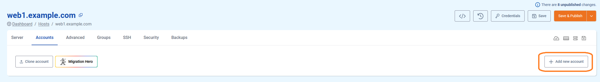
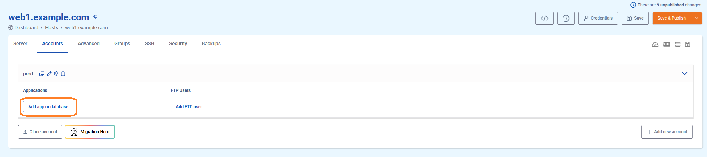
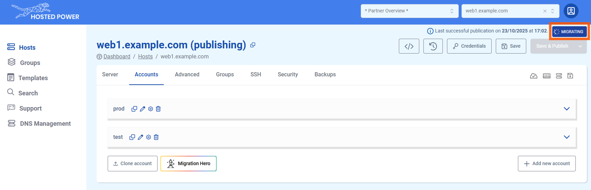

# Accounts & Application Management

## What is an account and what is it used for?

The account is a linux user which can be used simply to access the server. However, you probably want to deploy one or multiple **applications** under this user. This guide will explain how to deploy system users and all settings your application requires.

In the [TurboStack Platform](https://my.turbostack.app "TurboStack Platform"), you can create accounts in two ways: either by creating a brand-new account or by cloning an existing one.

!!!
For staging and production instances of an application, best practice is always to use an entirely different server, because it's by design unavoidable that resources allocated for staging, will be (silently) "taken away" from production. Even when this staging application is rarely used, it would still consume memory for e.g. databases, causing avoidable overhead.
!!!

## Creating a new account

### How to deploy a new account in the GUI

Creating a new user on the [TurboStack Platform](https://my.turbostack.app "TurboStack Platform").

* Open the TurboStack Platform
* Open the server view

1. Go to the `Accounts` page

2. Add a new account (user)

3. Give the account a name and save

4. `Save and Publish` will deploy the change to the host


### How to deploy a new account in the source YAML [!badge icon="alert" text="Advanced"]

for more advanced users there also the YAML configuration.
adding a new account can be done with

```yaml
system_users:
  - username: prod
```


Now an account is created. Applications can be installed.

## How to create a new application

* Open the TurboStack Platform
* Click the host view
* Select to host to update

### Prerequisite

Creating a new user on the [TurboStack Platform](https://my.turbostack.app "TurboStack Platform").
An account must exist before an application can be configured.
How to create a new [account](./howto_newuser.md)

### Creating a new application in the TurboStack Platform

Creating a new (default) application under the newly created `prod` user.
Scenario: creating a Magento2 application, listening on `www.example.com` and using varnish as caching

1. Open the detail section for the user

2. Click to add a new application

3. The first application for each user should always be `default`

4. Go to `Hostnames` and 1 or more names the website should listen on
5. Choose a website SSL certificate, there are 3 options: `letsencrypt`(default), `self-signed` and `custom` (3rd party certificate) (*)

6. Go to `Technologies` and set the app type (**) that matches your application
7. Enable PHP or another technology that your application requires

8. Scroll down to enable `varnish`

9. When going live, set a `monitoring url` so Hosted Power will monitor 24/7.

10. Click `Save` to save and exit the configuration wizard.


Now the new application is configured, click `Save & Publish` to deploy the configuration to the server.


(*) Let's Encrypt certificates can only be validated if the selected hostnames already have the proper DNS settings to point them to the server. If this condition is not met, the validation will fail, and publishing will throw an error! If you cannot adjust DNS, but you do need HTTPS, you can choose a self-signed certificate and change it to Let's Encrypt whenever you're ready.

(**) The app type should match the CMS or framework that will be installed on this environment, and automatically applies some application-specific configuration. Can't find your CMS of framework in this list? Contact us!

### Creating a new application in source code mode (YAML) [!badge icon="alert" text="Advanced"]

For more advanced users there also the YAML configuration.
adding a new application can be done with

```yaml
system_users:
  - username: prod
    vhosts:
      - server_name: example.com www.example.com
        app_type: magento2
        php_version: "8.2"
        varnish_enabled: true
        cert_type: self-signed
```

!!! 
a system_user (e.g. `prod`) is needed before an application can be deployed
!!!


## Migrating your external application using Migration Hero

To simplify the migration of your external application to TurboStack, the **Migration Hero** feature is available. It automatically transfers the full configuration, files and database. Enabling a fast and efficient setup with minimal effort.

!!! info
Before starting, make sure you have already created an application and successfully performed a **Save and Publish**.
!!!

!!! info
If you want to migrate an application from TurboStack to TurboStack, please use the **Clone** feature documented below.
!!!

Here’s how to do it:

1. Navigate to the `Accounts` tab in the TurboStack Platform under your host.


2. Click `Migration Hero`.


3. In the next step, enter the remote host and the user you want to migrate. 
Then, choose the authentication method you want to use to connect to the remote host.


4. **Option 1:** Enter the password for the user on the remote host, then click `Next`.


5. **Option 2:** Generate and add the provided public SSH key to the `.ssh/authorized_keys` file on the remote host, then click `Next`.


6. Choose the destination account (it must be an existing one) and select whether to migrate the database, files, or both. Then click `Next`. 


7. Select the hostname(s) you want to associate with the account and choose the type of certificate to activate. Click `Start Import` to begin the migration.


8. A migration progress popup will appear in the bottom-right corner. Once it finishes, your migration is complete. 


## Cloning an account

To make a clone of an existing application, we provide the `Clone Account` feature. This function replicates the entire configuration and copies the files and database, enabling a quick and efficient setup with minimal effort.

!!!Info
This feature is extremely useful to quickly copy your production environment to a staging environment or vice versa!
!!!

Here’s how to do it:

1. Navigate to the `Accounts` tab in the TurboStack Platform under your host.

2. Click `Clone Account`.

3. In the next step, select the source host and the account you want to clone. This can be either the current server or another server you manage.

4. Choose the destination account, which can be either an existing or a new account, and choose whether to clone the database and/or files. Click `Next`. 

5. Select the hostname(s) you'd like to associate with the account and choose the type of certificate you want to activate. Click `Next` to finalize.


And that’s it! Your application is now cloned to a new account. Be sure to save the configuration and publish it when you're ready.

## Fetch database and user credentials

!!!
Make sure you have already created an existing user with a successful publish.
!!!

You can fetch the credentials from the application you just created.
To do this, click on the gear icon next to the user and navigate to the **Database Info** tab.


To get database credentials


To get user credentials


## Add extra database user

It is possible to add an additional database user with read-only or admin access to a databases. You can also retrieve the credentials for this user.


**admin**: Full access to ALL server databases.  
**read-only**: Read-only access to the specific application database.


