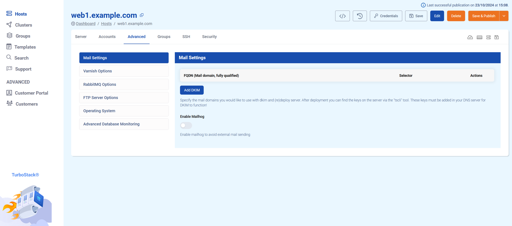
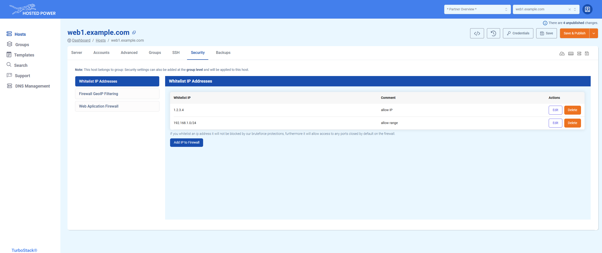
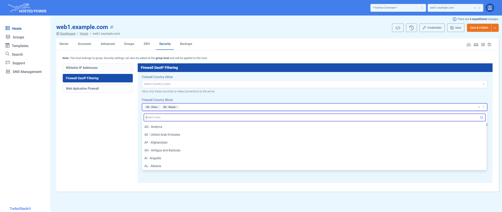
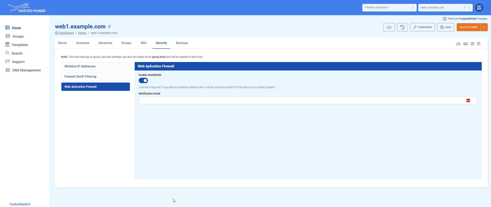

# Overview

## Login and locate your managed servers

When going to the [TurboStack Platform](https://my.turbostack.app/ "TurboStack Platform") , login with your credentials for the [Customer Center](https://portal.hosted-power.com/ "Customer Center").

If you don't have a login to the Customer Center yet, you first have to create a Primary account. More info [here](https://docs.turbostack.app/#create-a-customer-profile).

Once logged in, all servers managed by this account will become visible in the **Hosts** tab.

## Accounts tab

The **account** tab defines the server users and the applications. Typically, a user can have one or more
applications.
In the examples below we have 2 users, `prod` and `stag`.
The prod user has an application running on the hostnames `example.com` and `www.example.com`

1. Shows user `prod` and its containing applications
2. Shows user `stag`, with a collapsed layout
3. Will create an additional user.

More info on accounts and application management can be found [Here](https://docs.turbostack.app/turbostack-app/howto_newuser/ "Here").

## Advanced tab

The **advanced** tab offers some more advanced configuration options for specific services, such as mail, Varnish, RabbitMQ, FTP, etc.

## Groups tab

The **groups** tab can link a server to an existing group.
Groups can define additional configuration that can then be applied to all nodes in that group. 

The groups can be used to configure SSH keys for everyone in your company. These rights can be quickly revoked on all servers in the group whenever necessary.

Another very powerful feature of groups is the ability to set custom settings which apply to all servers in the group. For example, it could be used to change the default timezone for all servers in the group.

More info on groups can be found [Here](https://docs.turbostack.app/turbostack-app/groups/ "Here").

## SSH tab

The **SSH** tab defines one or more public SSH keys that allow shell access to a TurboStack node without using password authentication.
SSH keys can be added, deleted and edited here.

You can also disable SSH password authentication completely by activating the checkbox "Only allow SSH authentication by keys".

For more details on creating and using SSH keys, click [here](../Miscellaneous/ssh.md)!

## Security tab

This is an advanced feature, please be cautious while changing values here.

The **Security** tab allows you to modify certain firewall settings.

### Whitelist IP Addresses

Here you can allow important IP adresses or range for your application.

For example:
* Your office IP
* Deployment server
* External service

A whitelisted IP will not be blocked by any _brute force_ protections and has access to any otherwise closed ports.

### FireWall GeoIP Filtering
Use this to explicitly allow or block whole countries. It's important to know that if you **allow** one or more countries, the rest will be blocked. 

You can search by either country code or the name of the whole country.

### Web Application Firewall
Here you can enable Imunify360 on your TurboStack server and configure the incident notification email address.

