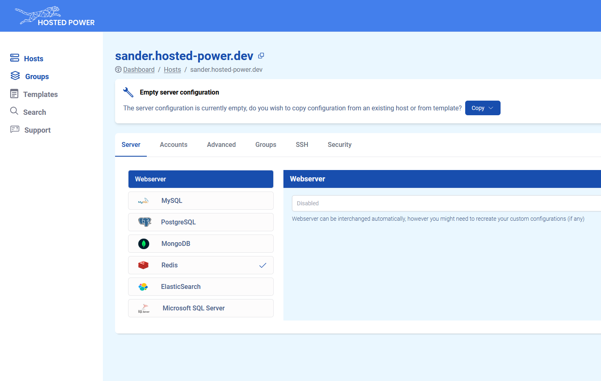
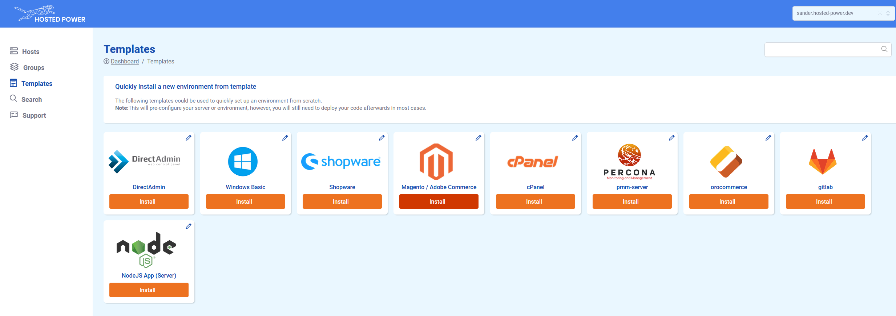
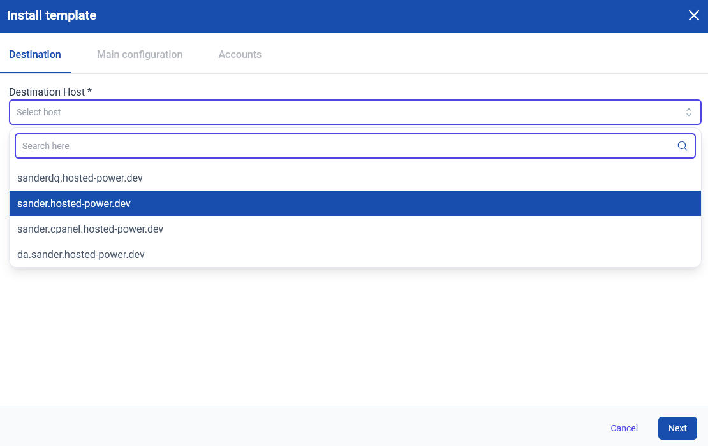
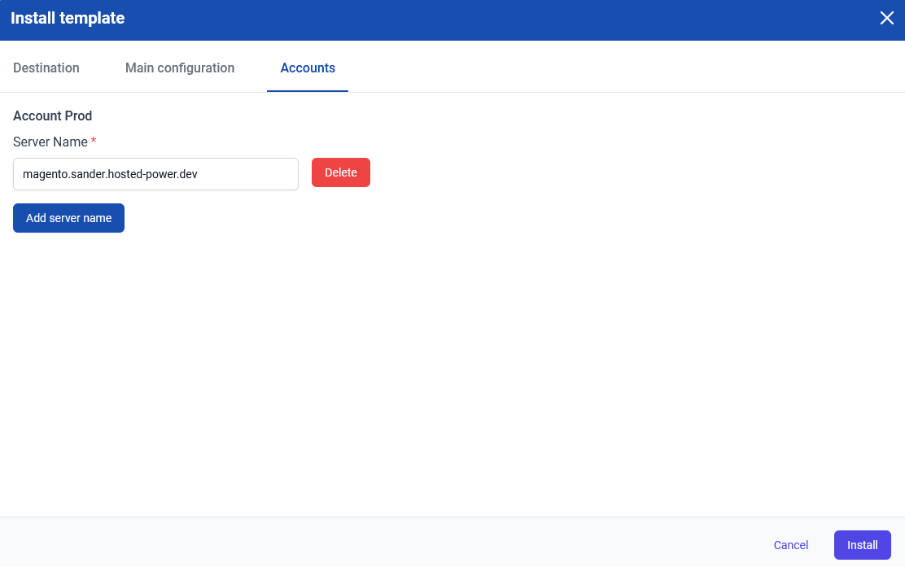
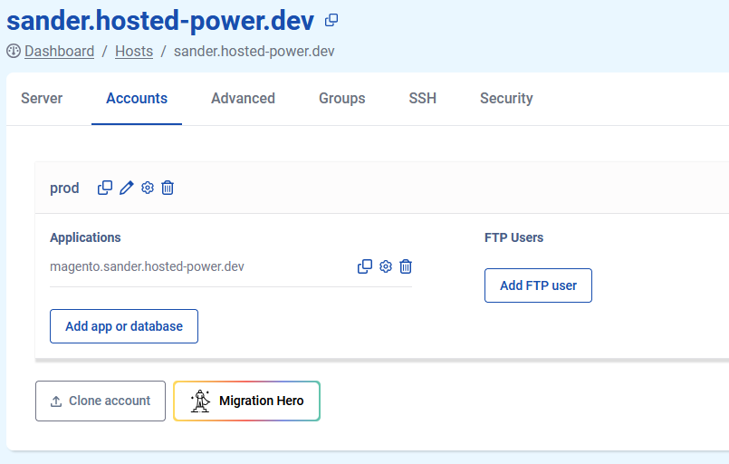

# Templates

Our platform has several [templates](https://my.turbostack.app/templates "Templates link") available for you to kickstart your server configuration. These can only be used when your server's configuration is still empty, as this would override any existing settings. 

## Step-by step-guide

The guide assumes you've gone through our [Getting Started](../quickstart.md "Quickstart guide link") guide. We'll be installing the Magento template as an example.

First, we check the config is empty. This is indicated by a banner above the GUI:

In the lefthand menu, select the 'Templates' option. This will bring you to the page below, showing the available templates. Click install on the desired template to bring up the template setup window.

In this config window, you'll be asked to choose which of your servers you'd like to install the template to from a drop-down menu. Then, you'll be asked to add a 'server name', this is where you add the URL you'd like your application to be reachable at.

Once all configuration options have been filled in, clicking 'Install will send this config to the server. At this point, you can return to your server's page and see that an application was added:

Don't forget to click 'Save & publish' to actually deploy the config to your server!