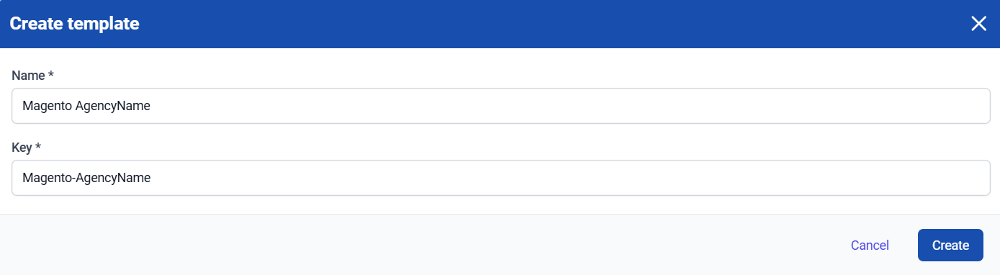

# Templates

Our platform has several [templates](https://my.turbostack.app/templates "Templates link") available for you to kickstart your server configuration. These can only be used when your server's configuration is still empty, as this would override any existing settings. 

## Step-by step-guide

The guide assumes you've gone through our [Getting Started](../quickstart.md "Quickstart guide link") guide. We'll be installing the Magento template as an example.

First, we check if the config is empty. This is indicated by a banner above the GUI:


In the left-hand menu, select the **Templates** option. This will bring you to the page below, showing the available templates. Click **install** on the desired template to bring up the template setup window.


In this config window, you'll be asked to choose which of your servers you'd like to install the template to from a drop-down menu. Then, you'll be asked to add a **server name**, this is where you add the **URL** you'd like your application to be reachable at.


Once all configuration options have been filled in, clicking **Install** will send this config to the server. At this point, you can return to your server's page and see that an application was added:


Don't forget to click **Save & publish** to actually deploy the config to your server!

### Make your own template
You have the possibility to create your own templates. This comes in handy when you need to regularly set up servers that have specific requirements. like a certain MySQL version and/or extra PHP packages. 

Using the templates, will make your deployments easier and faster.

To do this, in the upper-right corner of the **Templates** tab, click **Create**. This will bring up a new screen where you can choose the name for the template.



After choosing a logical name for your template, create your template.

You will now be brought to our _YAML_ editor. Here you can paste a generalized config of a server, of which you want to make a template.

Here is an example:
```yaml
---
webserver: nginx

postgresql_version: 16

os_extra_packages:
- libxml2-dev
- libxslt1-dev
- libldap2-dev
- libsasl2-dev

system_users:
- username: prod
  vhosts:
  - server_name: example.com www.example.com
    app_name: odoo
    app_type: odoo
    python_version: 3.10.17
    docker_enabled: true
    cert_type: selfsigned
```