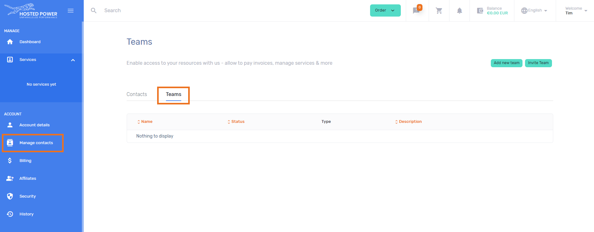

# cPanel

## How to correctly configure Magento 2 cronjob under cPanel

Login via ssh as the account user (or login via cPanel -> Cronjobs)

```
# crontab -e
MAILTO=""
* * * * * /usr/local/bin/php -d memory_limit=-1 /home/demoshop/public_html/bin/magento cron:run > /home/demoshop/public_html/var/log/magento.cron.log
* * * * * /usr/local/bin/php -d memory_limit=-1 /home/demoshop/public_html/update/cron.php > /home/demoshop/public_html/var/log/update.cron.log
* * * * * /usr/local/bin/php -d memory_limit=-1 /home/demoshop/public_html/bin/magento setup:cron:run > /home/demoshop/public_html/var/log/setup.cron.log
```
(Replace demoshop by your own account name)

## FIX - AutoSSL reduced SSL coverage

This is a known problem in cPanel AutoSSL.
 
This now requires each subdomain be verified individually. If this fails, they will automatically stop including them in the attempt and send an alert to your configured mail addresses. This can get very spammy, so you might want to solve the root cause. More context at the official cPanel docs. 

To resolve this, we recommend you check the configured domains. As you can see in the screenshot below, this often includes auto-generated cPanel subdomains


