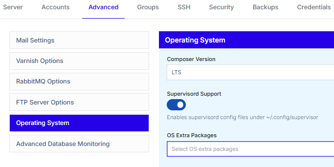

# Supervisord
Supervisor(d) is a process control system that allows you to run, monitor, and manage long-running programs on your server. It starts configured processes, keeps them running, restarts them if they fail, and provides command-line tools for checking status, stopping, starting, and restarting services. It is commonly used to manage application workers, background jobs, and other supporting processes in a simple and consistent way.

## Enabling it via the TurboStack Platform
You can enable this setting by going to your server in the TurboStack Platform, then going to `Advanced` > `Operating System`. Here you'll find the `Supervisord Support` slider.

After enabling this setting, publish the config to start the installation.



## Enabling it via the YAML editor
You can enable this setting by adding the following to your TurboStack config:

```yaml
supervisor_enabled: true
```
After adding the above config, **publish** the config to start the installation.

## Configuring your services
Supervisord services work via `.conf` files. These files can be found in the `~/.config/supervisor/conf.d/` directory.

The **Logs** can be found in the `~/.config/supervisor/log/` directory.

An example of a `.conf` file:

```ini
[program:messenger-consume]
command=php /var/www/<USER>/current/bin/console messenger:consume async failed hello_retail --time-limit=3600 --memory-limit=512M
user=<USER>
numprocs=4
startsecs=0
autostart=true
autorestart=true
process_name=%(program_name)s_%(process_num)02d
stdout_logfile=/var/www/<USER>/.config/supervisor/log/messenger-consume.log
stderr_logfile=/var/www/<USER>/.config/supervisor/log/messenger-consume.error.log
```
**Note**: A config sample can also be found at `~/.config/supervisor/conf.d/00-sample.conf.sample`.

### Enabling your services
After creating your service file, you will now need to enable it.
You can do so with the following commands:
```bash
supervisorctl reread
supervisorctl update
```
This will read all the config files in the conf.d directory and enable them.
 
## Managing your services
You can use the `supervisorctl` command to manage and troubleshoot your services.

Display all processes and their status:
```bash
supervisorctl status
```

Start a process:
```bash
supervisorctl start <process_name>
```

Stop a process:
```bash
supervisorctl stop <process_name>
```

Restart a process:
```bash
supervisorctl restart <process_name>
```

Tail the logs of a process:
```bash
supervisorctl tail -f <process_name>
```
