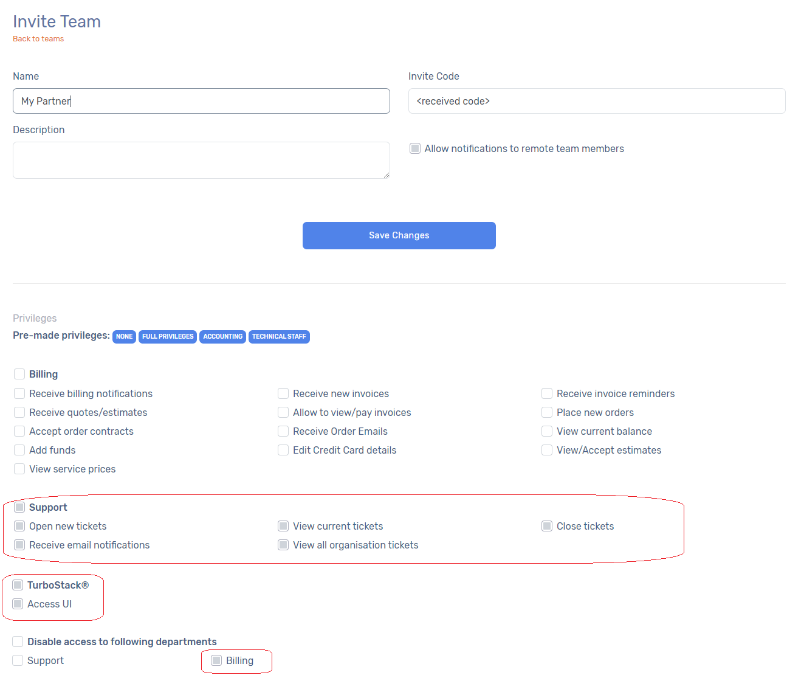
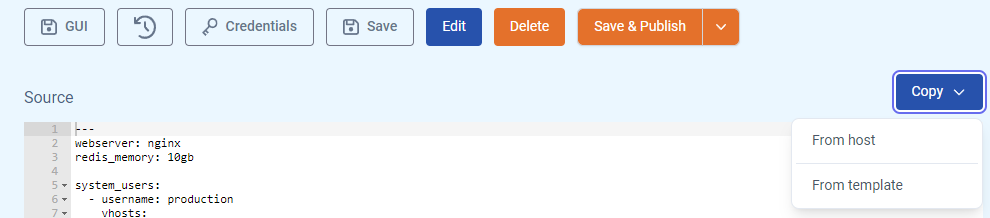

# Getting Started

Welcome to our TurboStack® knowledge base! Whether you’re gearing up for your first deployment or diving into more advanced configurations, we’ve got you covered. 

TurboStack® offers a suite of scalable packages designed for lightning-fast performance, including staging and production environments that can be clustered to meet your needs. [Check out our packages here](https://www.hosted-power.com/en/turbostack#our-packages).

If you’re here to access your Proof-of-Concept (PoC) environment or production TurboStack for the first time, you’re in the right place. Let’s get started! ⚡️

## Account Setup

### Create Your Customer Profile
Before you start, create a new account in our Customer Center. This grants you access to your profile and environments. Sign up [here](https://portal.hosted-power.com/signup/) and fill in the required details to get started.

## Login into the Hosted Power Customer Center
Access the Customer Center via this link: [portal.hosted-power.com](https://portal.hosted-power.com/ "Hosted Power Customer Center").

Our customer center enables you to:

* Manage contacts
* Add billing information
* Follow-up on your support tickets
* Purchase or transfer domain names
* Assign rights to various contacts
* Add SSH users, configure SSL certificates
* etc...

### Add Relevant Contacts
Once you've created an account, proceed to add all relevant contacts to your account.

This step is crucial for effective communication and collaboration between Hosted Power & your team.

!!! Important
Adding relevant contacts to your account ensures that the right people receive the right information and communication. They could also be used to contact you in cases of emergency.
!!!

### External Partner Integration (optional)
*Ihis section is only relevant if you're working with a partner that needs access to your account to configure the environments and/or has to be notified about support tickets etc.*

If you're a customer working through a partner, from now on referred to as "Hosted Partner" -*pun intended*-, TurboStack provides a seamless integration process. Request to link your account to the Hosted Partner using our innovative "teams" feature. The Hosted Partner can then supply you a unique code, enabling you to seamlessly join your account.

When the partner is linked to your account, the partner will automatically be linked to your account and they will for example be able to get support ticket notifications (if enabled). Furthermore they will be able to control your environments and servers via our TurboStack® GUI portal.

Under Customer Center > Managed Contacts > Teams you will find the invite team button where you can invite the partner as soon as you recieved the "Invite Code"

Likely the following checkboxes are of particular intrest

This integration enhances coordination and ensures a unified workflow and allows communicating the right information to the right people.

### Set Permissions

TurboStack empowers you with granular control over account permissions. Navigate to the settings and check the appropriate permissions for each contact. Specify who can manage servers, access billing information, receives invoices, handle tickets, and more. This level of customization enables you to allocate resources efficiently by determining which employees can work on specific projects.

**Congratulations!** You have now successfully set up your account, laying the foundation for efficient account management and collaboration within the Hosted Power ecosystem.

## TurboStack® Suite GUI

Once you have your customer profile set up, it's time for the real work.
Let's check out your TurboStack environment in the [TurboStack App](turbostack-app/basic_install/)

## Getting started with your TurboStack

### 1. Deployment

Most applications can be easily deployed, as we already have fully optimized TurboStack technology for most commonly used open source solutions. Once deployed, you will receive the necessary info to be able to manage your TurboStack environment.

### 2. Login via SSH

Get started by [creating SSH keys and logging in to your TurboStack via SSH](turbostack_configuration/SSH.md).

### 3. Configure your TurboStack

#### 3.1 Infrastructure As code with YAML

It's also possible to configure TurboStack node simply by editing and/copy pasting the source code of the complete configuration (YAML file) in the app. More info on the [YAML Source code](TurboStack App/YAML.md).

#### 3.2 TS CLI

[More info](turbostack_configuration/ts_cli.md) on our TurboStack Command Line Interface

### 4. Clone settings from an existing TurboStack

You can clone existing server settings via the *Source code* (Yaml) view. It allows you to use a predefined template or to create an exact copy of the configuration of an already runnining environment

### 5. Installing a new application on your TurboStack

## In need of Support?

Got burning questions or bursting with feedback? Don't hold back – we thrive on it! Shoot us a message at [support@hosted-power.com](mailto:support@hosted-power.com) or call us at +32 53 599 000, and our squad of Turbo-trouble solvers will swoop in. Hosted Power's sales and support gurus are at your service on weekdays during office hours. Of course you can count on your SLA should critical incidents happen.
