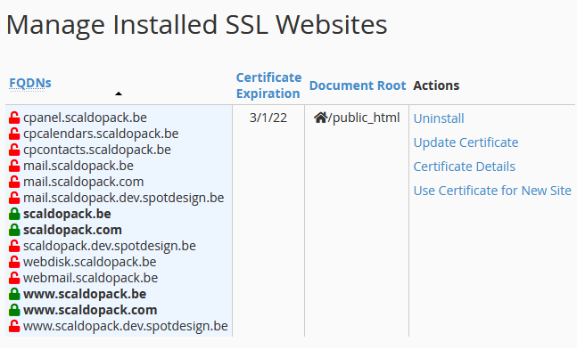
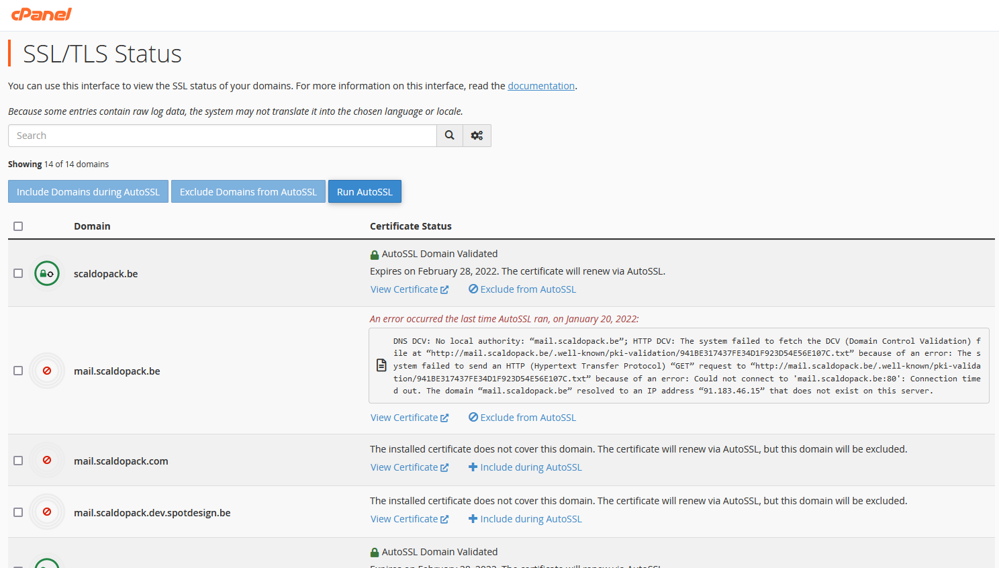

# cPanel

## How to correctly configure a Magento 2 cronjob under cPanel

Login via ssh as the account user (or login via cPanel -> Cronjobs)

```
# crontab -e
MAILTO=""
* * * * * /usr/local/bin/php -d memory_limit=-1 /home/demoshop/public_html/bin/magento cron:run > /home/demoshop/public_html/var/log/magento.cron.log
* * * * * /usr/local/bin/php -d memory_limit=-1 /home/demoshop/public_html/update/cron.php > /home/demoshop/public_html/var/log/update.cron.log
* * * * * /usr/local/bin/php -d memory_limit=-1 /home/demoshop/public_html/bin/magento setup:cron:run > /home/demoshop/public_html/var/log/setup.cron.log
```
(Replace demoshop by your own account name)

## FIX - AutoSSL reduced SSL coverage

This is a known problem in cPanel AutoSSL.
 
This now requires each subdomain be verified individually. If this fails, they will automatically stop including them in the attempt and send an alert to your configured mail addresses. This can get very spammy, so you might want to solve the root cause. You can find more context in [the official cPanel docs](https://support.cpanel.net/hc/en-us/articles/4416419981335-Potential-reduced-AutoSSL-coverage-notification). 

To resolve this, we recommend you check the configured domains. As you can see in the screenshot below, this often includes auto-generated cPanel subdomains



As you can see, there's a lot of unprotected subdomains, however, none of these are actually in use. As such, you can safely exclude these from your certificate.
To do this, you need to be logged in as the user of the domain for which the certificate is being generated.

Once logged in, you need to find the following option in your main menu: SSL/TLS Status 

That page will look like this:


Here you can see what your subdomains might look like. "AutoSSL Domain Validated" means it works, so you can ignore those. Then, all subdomains in red need to be checked. If you don't use the subdomain, you should click "Exclude from AutoSSL" as seen in the second item in the screenshot. 
Once you've dealt with all subdomains in error, you can click the "Run AutoSSL" button at the top of the page to re-run the validation. This will mean no more errors when running AutoSSL, and no more alert spam!
