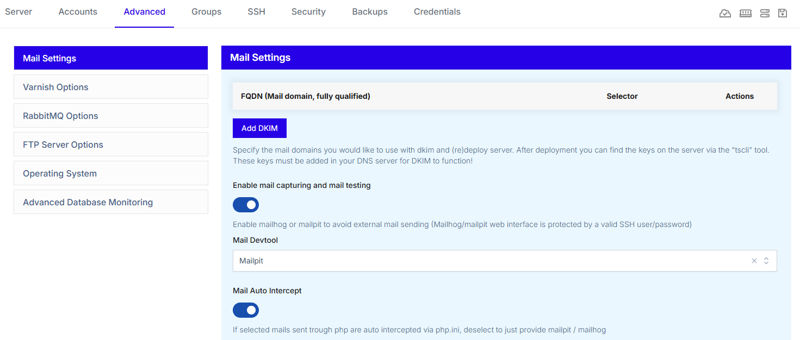

# Mailpit and Mailhog
Our TurboStack supports two _mail dev tools_ for you to choose from.

`Mailpit` and `Mailhog` are developer tools for testing emails safely. They act like a local SMTP server. Your application “sends” emails to customer email addresses, but the emails are not actually delivered to them.

Instead, the emails are captured and shown in a web interface, where developers can inspect the subject, content, headers, links, and formatting. 

Both tools are useful during development and automated testing because they prevent accidental real email delivery while making it easy to verify that email functionality works correctly.

!!! info
We currently recommend Mailpit over Mailhog, as the Mailhog project is no longer receiving updates!
!!!

## Enable it in the TurboStack GUI
In the TurboStack GUI of your server, go to `Advanced` > `Mail Settings`, then click the toggle `Enable mail capturing and mail testing`.

New options will then show, where you can choose between `Mailpit` and `Mailhog`.

If you want to temporarily disable the service, you can do so with the `Mail Auto Intercept` toogle.



## Enable it via the YAML editor
To enable this via our YAML editor, add the following to the config:

```yaml
mail_devtool: mailpit
```

To temporarily disable the mail intercept, add the following line under `mail_devtool`:

```yaml
mail_auto_intercept: false
```

## Accessing the tool GUI

To access the tool, you can do so by going to the IP or domain of your application and append 
- `http://[IP_OR_DOMAIN]/mailpit` for Mailpit
- `http://[IP_OR_DOMAIN]/mailhog` for Mailhog

You will then get a `Basic Auth` prompt where you'll need to enter the credentials of a _system user_. These login details can be found in the **Credentials** tab of your server in the TurboStack GUI.
