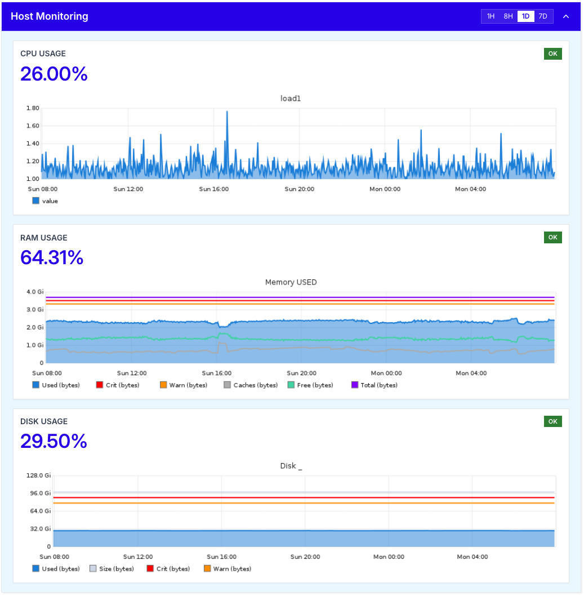
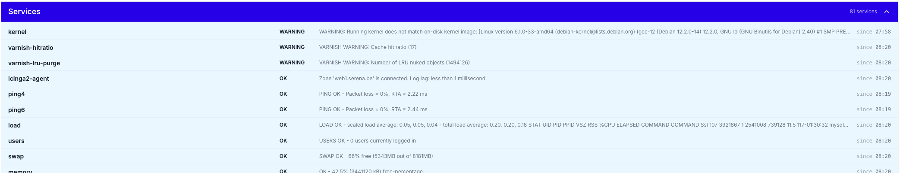

# Health - server monitoring and status overview

The **Health** tab is your first stop when opening a host. It provides a real-time overview of the server's condition, surfaces the most important alerts, and gives you direct access to detailed monitoring reports and services.

Unlike the fleet-wide [Monitoring dashboard](../monitoring.md), the Health tab is scoped to a single host, showing how this specific server and its applications are behaving right now and over time.

The Health tab does more than show status: for every entry under **Top Issues** and every report under **Latest Reports**, the TurboStack platform adds an analysis of the underlying problem together with recommendations on how to fix it.

The tab is divided into four areas, each described below:

- **[Host Monitoring](#host-monitoring)** (top right) - live CPU, RAM and disk usage.
- **[Top Issues](#top-issues)** (top left) - the most important active alerts on the server.
- **[Latest Reports](#latest-reports)** - a chronological list of health reports for the server and its applications.
- **[Services](#services)** (bottom) - the full list of monitored services and their current status.

## Host Monitoring

The **Host Monitoring** panel displays the most important resource metrics of your server at a glance:

- **CPU Usage** - the current CPU load, accompanied by a graph showing the `load1` average over time.
- **RAM Usage** - the current memory consumption, with a detailed breakdown of used, free, cached, warning and critical thresholds.
- **Disk Usage** - the current disk consumption on the root filesystem, plotted against warning and critical thresholds.

Each metric is shown as a percentage, combined with a colour-coded status indicator (OK, Warning, Critical) so you can immediately spot any resource that needs attention.

### Timeframe selector

In the top right corner of the panel, you can switch the timeframe of the graphs between **1H**, **8H**, **1D** and **7D**. This lets you zoom in on a recent spike or zoom out to spot longer-term trends in resource usage.

!!! info
The Host Monitoring graphs are based on the same data used by our 24/7 monitoring system. If a metric crosses a critical threshold, our team is alerted automatically.
!!!

## Top Issues

The **Top Issues** panel lists the most important active alerts on your server right now. Each issue is tagged with a category (e.g. `AVAILABILITY`, `STABILITY`, `PERFORMANCE`) and a status (e.g. `Open`).

Clicking an issue expands it to reveal:

1. A detailed description of the problem, including the affected service and the impact on your environment.
2. A proposed solution suggested by the TurboStack platform, based on the type of issue and the server's configuration.

This makes it easy to understand what is wrong, why it matters, and what to do next, without having to dig through logs or external dashboards.

## Latest Reports

The **Latest Reports** section, below Top Issues, provides a chronological list of detailed health reports generated for the server and its applications.

Each report is linked to a specific check (e.g. `rabbitmq-online`, `postgres-online`, `website`) and includes the severity level (e.g. `P1 CRITICAL`), the affected host or URL and the time the report was generated. Click **Open report** on any entry to view the full report, including timestamps, related metrics and historical context. This is particularly useful when investigating incidents or preparing a post-mortem.

## Services

The **Services** panel, at the bottom of the tab, shows a complete list of every monitored service on the server, together with its current status and the latest check output. For each service you will see:

- The **service name** (e.g. `postgres-online`, `ping4`, `disk /`, `smtp`, `mysql-uptime`).
- The **status** (`OK`, `WARNING`, `CRITICAL`, `UNKNOWN`).
- The **plugin output**, which contains the raw result of the check (e.g. response times, free disk space, error messages).
- The **timestamp** of the most recent check.

This view gives you a complete overview of everything we monitor on your server, making it easy to confirm that all services are healthy or to drill down into a specific check that is failing.

!!! info
If a service is in an `UNKNOWN` or `CRITICAL` state and you are not sure how to resolve it, please contact our [Support](../../Support/standard_support.md) team. Our engineers have access to the same monitoring data and can intervene 24/7. See our [24/7 monitoring and alerting](../../Support/monitoring.md) overview for how this works.
!!!
