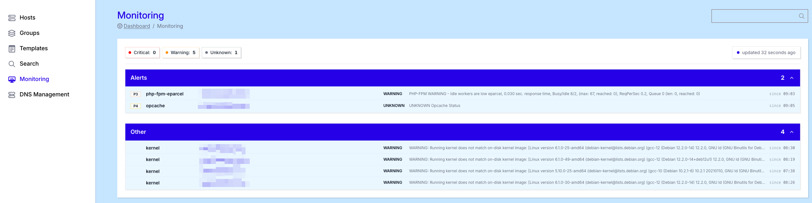
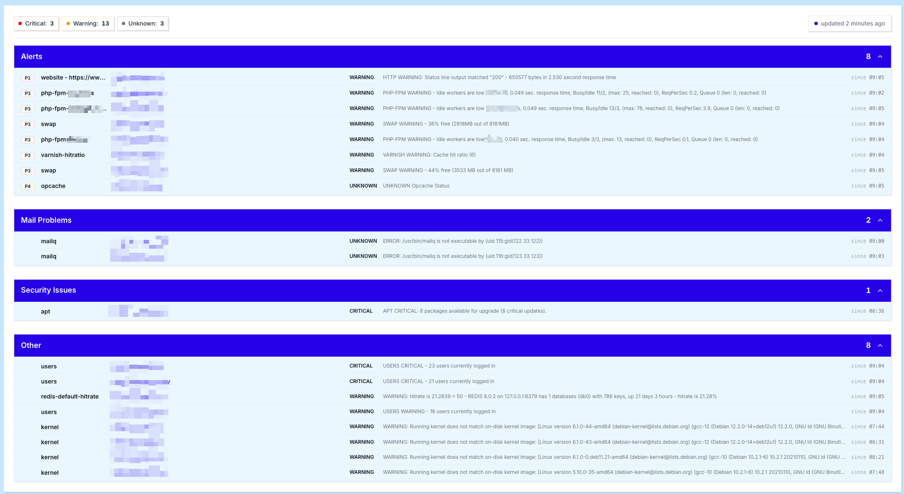

# Monitoring

Hosted Power proactively monitors your infrastructure, tracking both server and service availability and resource usage around the clock. As soon as a critical threshold is crossed - high load, low disk space, a failing service or an unreachable website - an alert is raised so the issue can be addressed before it impacts your environment.

On top of automated monitoring, our engineers are available 24/7 via phone and ticket to investigate alerts, intervene where needed and assist with any infrastructure or application issue. For more information on how to reach us, or to open a support ticket or call our support line, see the [Support](../Support/standard_support.md) page. To learn how our team acts on these alerts around the clock, see our [24/7 monitoring and alerting](../Support/monitoring.md) overview.

## Dashboard

The **Monitoring** page in the left-hand menu features a dedicated **Dashboard** that provides a fleet-wide overview of every open alert across all your servers and applications. Only checks in a non-OK state are shown, so the dashboard always reflects the issues that still need attention. For a detailed, per-host view of these alerts, resource metrics and reports, open the [Health tab](Hosts/health.md) of an individual host.

Alerts on the dashboard are grouped into four categories, each focused on a specific type of problem:

### Alerts

The **Alerts** panel lists the most important server and application checks that are currently in a non-OK state. Entries are sorted by criticality: first by priority (P1 is the most critical, P4 the least, explained under [Alert priorities](#alert-priorities) below), then by status within each priority (`CRITICAL`, then `WARNING`, then `UNKNOWN`).

This ordering ensures that the most urgent issues are always at the top of the list, so you know exactly where to start when multiple alerts are open at once.

### Mail Problems

The **Mail Problems** panel highlights issues related to mail applications and their deliverability. This includes problems with the local mail queue (`mailq`), blocked or filtered messages, SPF or DNS-related warnings, and other indicators that mail is not flowing as expected.

### Security Issues

The **Security Issues** panel surfaces hosts where security or system packages have not yet been installed or updated. A typical example is an `apt` check reporting available critical updates that still need to be applied to keep the server secure.

### Other

The **Other** panel collects remaining issues that are still worth reviewing, but are less critical and less urgent than the items in the other categories. Use this section to keep an eye on lower-priority signals that should not be ignored, but do not require immediate intervention.

!!! info
Clicking any alert on the dashboard takes you straight to the detailed view of that alert on the specific server it belongs to, so you can investigate the root cause without having to navigate through the host configuration manually.
!!!

## Alert priorities

Every alert is assigned a priority from P1 to P4, indicating how urgently it needs to be addressed. This priority determines both the ordering on the dashboard and how quickly our team intervenes.

- **P1 - Critical** - something is down or broken that is impacting the server and its applications. This requires immediate action.
- **P2 - Very urgent** - something is down, broken or degraded that will potentially cause a P1 if no action is taken within 2 hours.
- **P3 - Urgent** - something is wrong that will potentially affect a P2 or escalate to a P1 if no action is taken within 8 hours.
- **P4 - Not urgent** - an issue that is best reviewed to keep the server stable over the long term, but does not require immediate intervention.

## Website monitoring URL

Per application, the [TurboStack Platform](https://my.turbostack.app/ "TurboStack Platform") can also monitor a website URL. Once added, Hosted Power monitors the availability of that URL and intervenes 24/7 if an issue arises.

The video below shows how to activate website monitoring for your application.

[!embed allowFullScreen="false"](https://player.vimeo.com/video/1056707252?title=0&amp;byline=0&amp;portrait=0&amp;badge=0&amp;autopause=0&amp;player_id=0&amp;app_id=58479)
